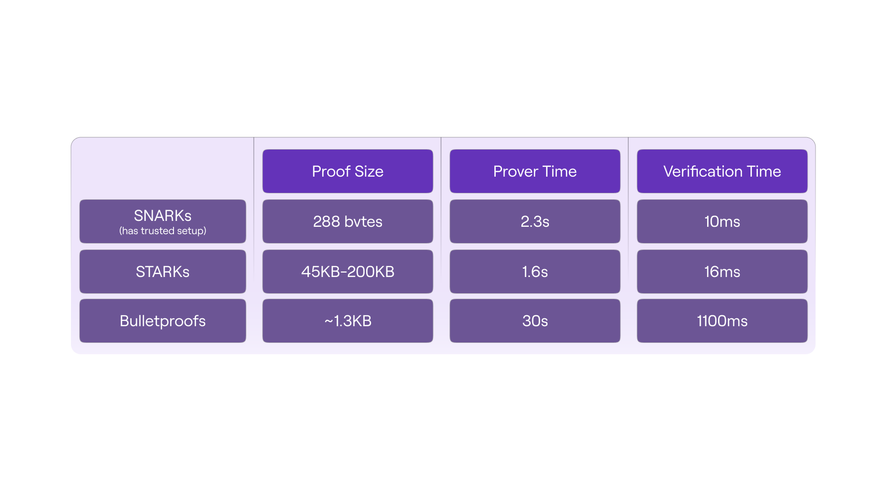
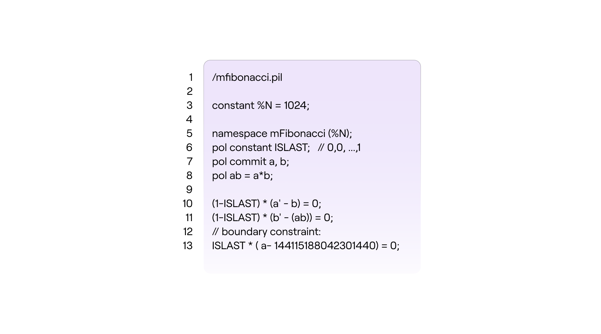
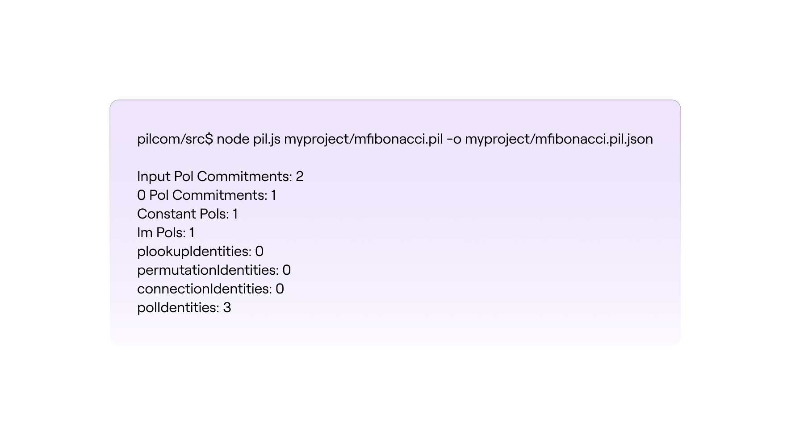
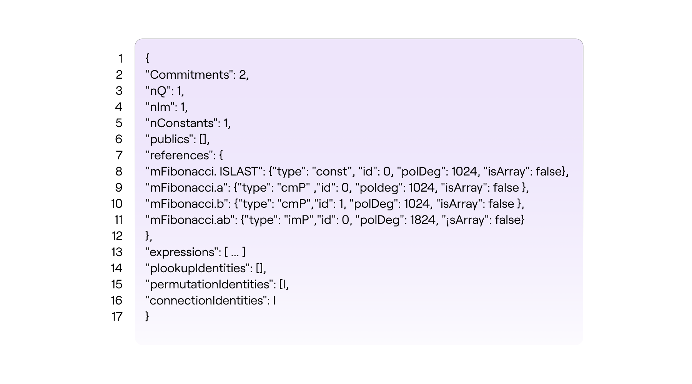

## Constructing the verification scheme

The zkEVM's basic proof system for proving correctness of all state machine computations is a **STARK**.

The fundamental configuration of the zkProver:

- It utilises STARK proofs for proving correctness of computations, due to their speed.
- For succinct verification, these STARK proofs are in turn proved with a single SNARK.
- So, it employs STARK proofs internally, while the publicised validity proofs are SNARKs.

## What is a STARK?

A [**STARK**](https://eprint.iacr.org/2018/046.pdf) is a **S**calable **T**ransparent **AR**gument of **K**nowledge based on the [Interactive Oracle Proof](https://www.iacr.org/archive/tcc2016b/99850156/99850156.pdf) (IOP) model. Although a STARK is not adequately succinct, as a proof system, it is generally categorised as a special [**SNARK**](https://eprint.iacr.org/2011/443.pdf) (which is short for **S**uccinct **N**on-interactive **AR**gument of **K**nowledge).

**Succinctness** here, refers to producing short proofs that are independent of the size of the *witness*, and thus enabling NP computations to be proved with substantially lower complexity than it is classically required, [AN2019](https://www.di.ens.fr/~nitulesc/files/Survey-SNARKs.pdf). In other words, an argument system for NP statements is succinct, if its communication complexity is polylogarithmic in the size of the statement or the witness.

A STARK falls short of succinctness because, although verifier arithmetic complexity is *strictly logarithmic* with respect to statement or witness size, prover arithmetic complexity is *strictly linear*, [BBHR18](https://eprint.iacr.org/2018/046.pdf). Yet, a STARK is **scalable** because it has at most a polylogarithmic prover overhead, and it is **transparent** as it requires no trusted setup.

See the table below, taken from the presentation [here](https://docs.google.com/presentation/d/1gfB6WZMvM9mmDKofFibIgsyYShdf0RV_Y8TLz3k1Ls0/edit#slide=id.g443ebc39b4_0_110), for a quick comparison of proofs sizes, prover and verification times, between STARKs, SNARKs and [Bulletproofs](https://eprint.iacr.org/2017/1066.pdf).

### FRI-PCS context

The performance of a STARK is ascribable to the context in which it is deployed, the **FRI** Polynomial Commitment Scheme (or FRI-PCS). The acronym [**FRI**](https://drops.dagstuhl.de/opus/volltexte/2018/9018/pdf/LIPIcs-ICALP-2018-14.pdf) is short for **F**ast **R**eed-Solomon **I**nteractive Oracle Proof of Proximity, also abbreviated as "**F**ast **R**S-**I**OPP".

On a high-level, FRI enables proving whether a given function $f : {\mathcal{H}} \to \mathbb{F}_p$ is “close” to a certain polynomial of low degree. Hence the term *proof of proximity*.

Loosely put, the FRI protocol allows for a random set of queries (requests for openings of polynomials at randomly selected field elements), used by the verifier to ascertain with high probability, the prover's knowledge of a committed polynomial.

FRI is in fact a Merkle commitment scheme where commitments are roots of Merkle trees, and therefore needs no trusted setup, as it only uses hash functions.

**The FRI protocol is considered fast for several reasons;**

1. Due to its resemblance of the ubiquitous Fast Fourier Transforms (FFTs).
2. The arithmetic complexity of the prover is strictly linear.
3. The size of the proof is O(n log(n)).
4. The arithmetic complexity of the verifier is strictly logarithmic.

Our special implementation of a STARK is called **PIL-STARK**, and its polynomial commitment scheme (PCS) is also based on the FRI protocol. We will later demonstrate how PIL-STARK is used to prove the polynomial identities of the mFibonacci state machine.

Before describing PIL-STARK a quick look at the novel Polynomial Identities Language (PIL), and some of its distinguishing features, will be helpful.

### Polynomial Identity Language

**PIL** is a domain-specific language (DSL) that provides a method for naming polynomials and describing the identities that define computations carried out by a state machine.

A typical $\texttt{.pil}$ file for a given state machine specifies the details of the computation that the state machine carries out;

- the size (or degree) of the polynomials. i.e., the number of rows of the execution trace.
- the namespace of the state machine, which becomes a prefix to names of the SM's polynomials.
- defines the $\texttt{ISLAST}$ polynomial as a constant (preprocessed) polynomial.
- defines committed polynomials; $\texttt{a}$ and $\texttt{b}$.
- the zero-checks of the transition constraints.
- and, a zero-check of the boundary constraint.

In cases where several state machines are being proved; although each SM may have a polynomial named "ISLAST", there would be no name-clashes in the Prover (and in the Verifier) because each polynomial is identified by prefixing its name with the namespace of the SM it belongs to. For example, $\texttt{mFibonacci.ISLAST}$ is the identifier of ISLAST where the mFibonacci SM has the namespace $\texttt{mFibonacci}$.

See the figure below for a description of the mFibonacci SM in PIL, as an $\texttt{mFibonacci.pil}$ file.

The value of the polynomial $\mathtt{a}$ in the next step (or state) of the state machine, is denoted by $\mathtt{a'}$ and it is read "a"-prime. i.e., If $\mathtt{a = P(\omega^i)}$ then $\mathtt{a' = P(\omega^{i+1})}$.

Note that the current version of the PIL language only accepts degree-two expressions. That is, a single multiplication such as $\texttt{(a-1)*a}$ and $\texttt{a*b}$, but not $\texttt{(a-1)*b*c}$.

The extra line, $\text{line 8}$ in the above figure was added for the very reason to prevent the double multiplication required in the zero-check;

$$
\mathtt{(1-ISLAST) * (b' - (a*b)) = 0;}
$$

by splitting it into two steps, $\text{line 8}$ and $\text{line 11}$.

### Compiling PIL into JSON

Due to the modular design of the zkProver, it is possible to take a $\texttt{.pil}$ file describing computations of any state machine and compile it into a parsed version, a $\texttt{.json}$ file, that can be interpreted by the other software components.

We demonstrate compiling the $\texttt{mFibonacci.pil}$ file into a $\texttt{.json}$ file with a novel Polynomial Identities Language Compiler, dubbed $\texttt{PILCOM}$. The details of $\texttt{PILCOM}$ will be documented elsewhere, but its repo can be found [here](https://github.com/0xPolygonHermez/pilcom). We treat it as a 'blackbox' in this demonstration.

Here's how to achieve the compilation of the $\texttt{mFibonacci.pil}$ file;

1. Clone the $\texttt{PILCOM}$ [repo](https://github.com/0xPolygonHermez/pilcom),
   $$
   \texttt{git clone https://github.com/0xPolygonHermez/pilcom}
   $$

2. Once cloned, switch directory to $\texttt{pilcom/}$, and install the module and build the parser,
   $$
   \texttt{pilcom\$ npm install}\text{ }\text{ }\text{ }\text{ } \\
    \texttt{pilcom\$ npm run build}
   $$

3. Type the lines of code, the $\texttt{mFibonacci.pil}$, into your code editor as it appears in Figure 7 above. You will need to Save it in some temporary folder. Whatever filename you give to the file, remember to use the "$\texttt{.pil}$" extension.

   In our case, we saved it in a folder named  $\texttt{myproject}$, and named the file  $\texttt{mFibonacci.pil}$

4. Compile the $\texttt{mFibonacci.pil}$ either at the $\texttt{pilcom}$ directory or the $\texttt{pilcom/src}$ subdirectory, using the command,
   $$
   \texttt{pilcom}\text{\$} \texttt{ node src/pil.js myproject/mfibonacci.pil -o myproject/mfibonacci.pil.json }\qquad\qquad\qquad\qquad\text{ }\\
   \text{or }\qquad\qquad\qquad\qquad\qquad\qquad\qquad\qquad\qquad\qquad\qquad\qquad\qquad\qquad\qquad\qquad\qquad\qquad\qquad\qquad\qquad\qquad\qquad\qquad\quad\\
   \texttt{pilcom/src}{\$ } \texttt{ node pil.js myproject/mfibonacci.pil -o myproject/mfibonacci.pil.json \qquad\qquad\qquad\qquad}\\
   \text{ }
   $$
   You might need to prefix the path "$\texttt{myproject/mfibonacci.pil}$" with "~/"  

5. If successful, the output report (printed in the terminal) looks like this, 

   It provides information on the number of polynomials used (both constant and committed), the number of polynomial identities to be checked, and other information pertaining to the number of identities checked with; $\texttt{Plookup}$ tables, $\texttt{Permutation}$ checks and $\texttt{Connection}$ checks.

6. The $\texttt{.json}$ file that $\texttt{PILCOM}$ produces has the name speciified in Step 4, and can be found in the folder (subdirectory) specified in Step 4.

   In our case, the $\texttt{.json}$ file produced by $\texttt{PILCOM}$ appears in the "MYPROJECT" folder as $\texttt{\{ \} fibonacci.pil.json}$ and its content looks like this (Well, after removing the many newlines),

   

   The $\texttt{\{ \} fibonacci.pil.json}$ file contains much more detail than the results seen in Step 5 above. For instance, it reflects the polynomial names prefixed with the state machine namespace $\texttt{mFibonacci}$ as stipulated to in the $\texttt{mFibonacci.pil}$ file.

   Each polynomial is further described with four (4) attributes;

   (a)  $\texttt{type}$ which specifies whether the polynomial is committed, constant or intermediate.

   (b)  $\texttt{id}$ is a unique identity associated to with the polynomial

   (c)  $\texttt{polDeg}$ reflects the degree of the polynomial

   (d) $\texttt{isArray}$ is a flag used to control array-based polynomial definitions.

Among all the contents of the $\texttt{\{ \} fibonacci.pil.json}$ file, there is a key called $\texttt{expressions}$ which is an array containing all the identities and operations among the corresponding polynomials.

Moreover, the $\texttt{\{ \} fibonacci.pil.json}$ file contains other keys representing all inclusion, permutation and copy constraint arguments.

Other fields, important for debugging purposes, are

- $\texttt{nCommitments}$: which specifies the total number of committed polynomials.
- $\texttt{Constants}$: which specifies the total number of constant polynomials referenced in the PIL file.
