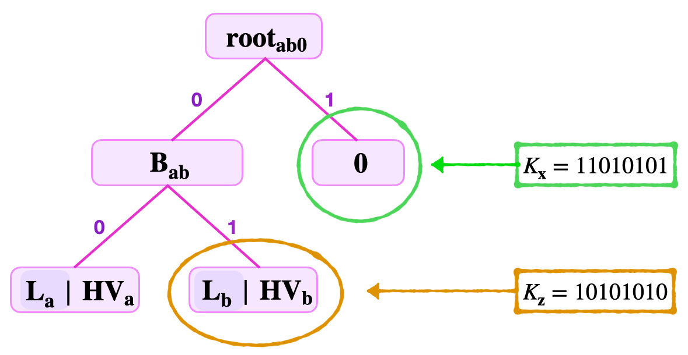
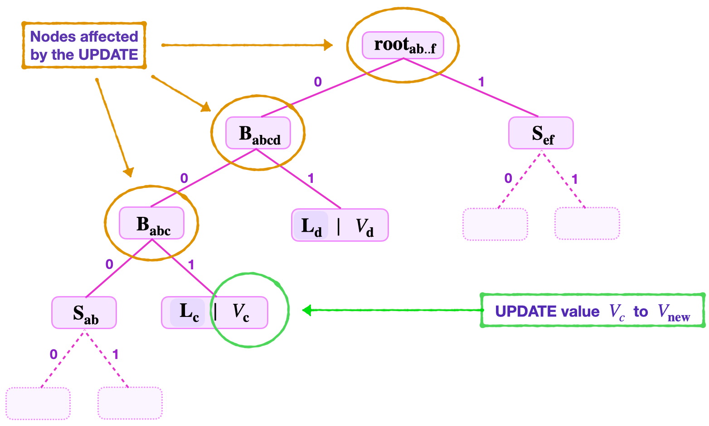
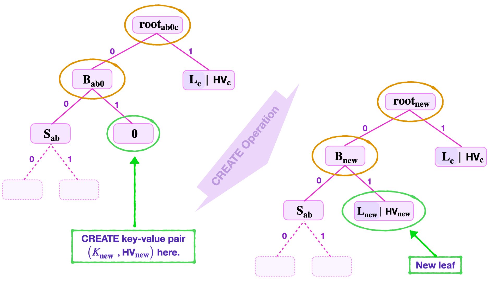
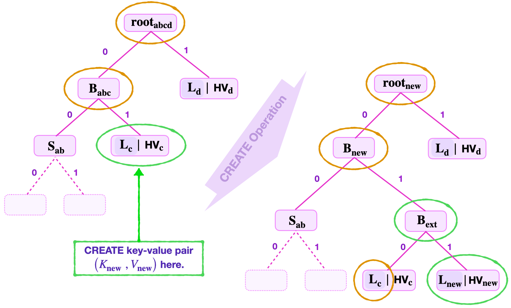
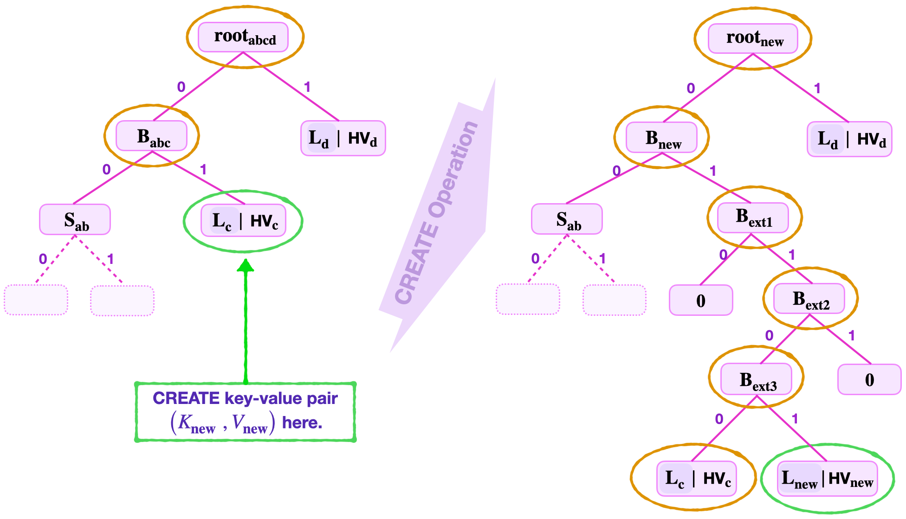
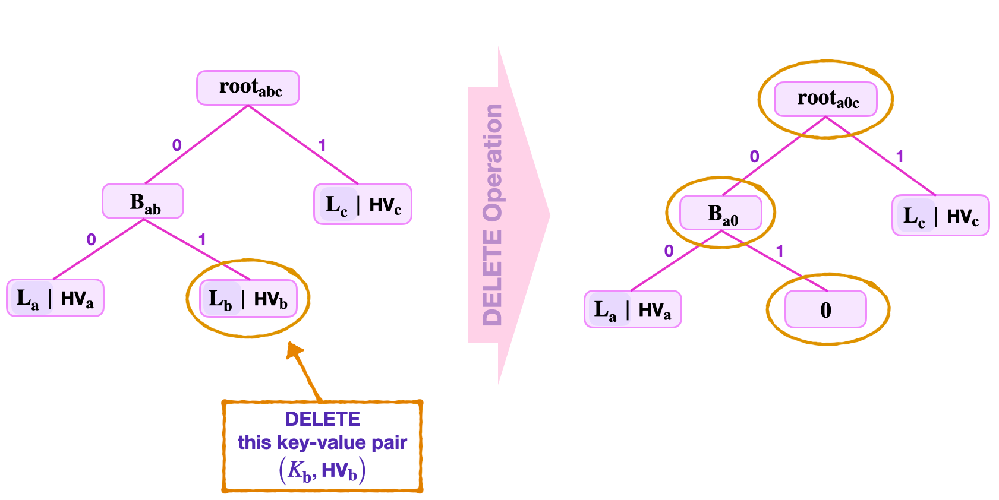
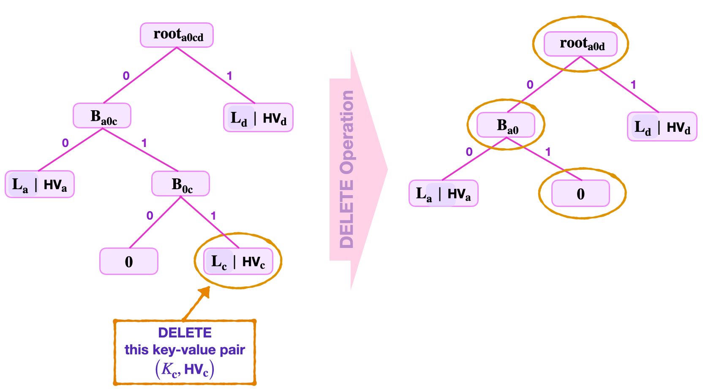

The previous sections have focused on the design of binary SMTs. The problems that cropped up with our initial design have assisted in refining and defining a secure design. While describing the design of binary SMTs, we have extensively utilised the **READ** or **Get** operation.

Now that the basic design is established, the other operations can be delineated. The operations that the Storage State Machine performs, as per instructions of the Main SM Executor, are called **Storage Actions**. As mentioned above, the Storage SM verifies whether the operations; **Create, READ, **UPDATE** and Delete (CRUD)**; executed by the Main SM were correctly computed.

## The READ operation

First, we illustrate the **READ** operation, which is in fact a **Get**.

The prover can commit to a key-value pair $(K_{\mathbf{x}}, \text{HV}_{\mathbf{x}})$ where $\text{HV}_{\mathbf{x}}$ is the hash of the value $V_{\mathbf{x}}$. That is, he claims that he created a leaf $\mathbf{L}_{\mathbf{x}}$ which contains the value $V_{\mathbf{x}}$ and it can be located using the key $K_{\mathbf{x}}$.

**READ** therefore means locating the leaf $\mathbf{L}_{\mathbf{x}}$ and verifying that it contains the value $V_{\mathbf{x}}$ by using a Merkle proof.

Hence, in addition to $(K_{\mathbf{x}}, \text{HV}_{\mathbf{x}})$, prover has to provide the rest of the information needed for completing the Merkle proof. That is, the root, the key-bits $\text{kb}_\mathbf{j}$ for locating the leaf $\mathbf{L}_{\mathbf{x}}$, the Remaining Key $\text{RK}_\mathbf{x}$  and all the necessary siblings.

#### What if the key is not set?

The next example demonstrates the **READ** operation when a key is not set in the tree. That is, it illustrates how to check whether a value is not on a given SMT.

There are two cases that can occur. The given key may lead either to a zero node or to an existing leaf.

If the given **key leads to a zero-node**, then the verifier needs only prove the existence of the zero-node, and this would sufficiently prove that the key is not set.

But if the given **key leads to an existing leaf**, the verifier has to prove the leaf exists in the SMT and show that the given key is not the same as the actual key associated with the value at the leaf.

### When The key is not set

Suppose the verifier needs to prove that the keys, $K_{\mathbf{x}} = 11010101$ and $K_{\mathbf{z}} = 10101010$ are not set in the SMT depicted in the figure below.

#### Case 1: When the key leads to a zero-node

The verifier receives the key $K_{\mathbf{x}}$, the remaining key $\text{RK}_\mathbf{x} = 1101010$, the least-significant key-bit $\text{kb}_0 = 1$, and the sibling $\mathbf{{S}_{1}} = \mathbf{{B}_{\mathbf{ab}}}$.

Since the least-significant key-bit of the given key, $\text{kb}_0 = 1$, navigation from the root leads to the right-side, to the zero-node. See the node circled in a green colour, in the above figure.

The task here is to verify that the node is indeed a zero-node.

So the verifier computes the root as follows,  $\mathbf{{\tilde{root}}_{ab0}} = \mathbf{H_{noleaf}} (\mathbf{{S}_{1}} \| \mathbf{0} )  = \mathbf{H}( \mathbf{{B}_{\mathbf{ab}}} \| \mathbf{0} )$.

Note that he concatenates $\mathbf{{S}_{1}}$ and $\mathbf{0}$ in the given ordering, because $\text{kb}_0 = 1$.

He then checks if  $\mathbf{{\tilde{root}}_{ab0}} = \mathbf{{root}_{ab0}}$. If this is true, then he concludes that the given key is not set.

#### Case 2: When the key leads to an existing leaf

Consider again the SMT depicted in the above figure, and suppose that the prover claims that the key $K_{\mathbf{z}} = 10101010$ is set.

The verifier is given; the key $K_{\mathbf{z}} = 10101010$, the Remaining Key $\text{RK}_{\mathbf{z}} = 101010$, the least-significant key-bit $\text{kb}_0 = 0$, the second least-significant key-bit $\text{kb}_{\mathbf{1}} = 1$, and the siblings  $\mathbf{{S}_{1}} = \mathbf{L}_{a}$  and  $\mathbf{{S}_{2}} = \mathbf{0}$.

When navigating the tree from $\mathbf{{root}_{ab0}}$, using the key-bits $\text{kb}_{\mathbf{0}} = 0$ and $\text{kb}_{\mathbf{1}} = 1$, and with reference to the above figure,

- the key-bit $\text{kb}_{\mathbf{0}}  = 0$ leads to the branch $\mathbf{{B}_{\mathbf{ab}}}$,

- then from $\mathbf{{B}_{\mathbf{ab}}}$, the key-bit $\text{kb}_{\mathbf{1}} = 1$ leads to the leaf $\mathbf{L}_\mathbf{b}$, which is the leaf circled in brown in the above figure.

Since the key navigates to a leaf, the Verifier's task is to prove two things simultaneously;

1. The leaf is in the SMT described in the above figure, and
2. The Remaining Key at the leaf $\mathbf{L}_\mathbf{b}$ is different from the Remaining Key supplied by the prover.

In proving that $\mathbf{L}_{\mathbf{b}}$ is indeed in the tree, the verifier carries out the following tasks simultaneously;

- **Checks The Root**

 1. Computes the hash of the hashed-value, $\mathbf{ \tilde{L} }_{\mathbf{b}} = \mathbf{H_{leaf}} ( \text{RK}_{\mathbf{b}} \| \text{HV}_{\mathbf{b}} )$,

 2. Uses the first sibling to compute, $\mathbf{{\tilde{B}}_{\mathbf{ab}}} = \mathbf{H_{noleaf}} \big( \mathbf{L}_{\mathbf{a}} \| \mathbf{ \tilde{L}}_{\mathbf{b}} \big)$,

 3. Then, uses the second sibling to compute the root, $\mathbf{\tilde{root}}_{ab0} = \mathbf{H_{noleaf}} \big( \mathbf{{\tilde{B}}_{\mathbf{ab}}} \| \mathbf{0} \big)$.

 4. Completes the root-check by testing equality, $\mathbf{\tilde{root}}_{ab0} = \mathbf{{root}}_{ab0}$.  

- **Checks the keys**

    The verifier takes the two Remaining Keys $\text{RK}_{\mathbf{x}}$ and $\text{RK}_{\mathbf{b}}$, and the key-bits $\text{kb}_0$ and $\text{kb}_{\mathbf{1}}$;

    1. Concatenates them as, $\tilde{K}_{\mathbf{x}} = \text{RK}_{\mathbf{x}} \| \text{kb}_0 \| \text{kb}_{\mathbf{1}}$ and $\tilde{K}_{\mathbf{b}} = \text{RK}_{\mathbf{b}} \| \text{kb}_0 \| \text{kb}_{\mathbf{1}}$,

    2. Checks $\tilde{K}_{\mathbf{x}} = K_{\mathbf{x}}$ and $\tilde{K}_{\mathbf{b}} = K_{\mathbf{b}}$, and

    3. Finally shows the inequality, $\tilde{K}_{\mathbf{x}} \neq K_{\mathbf{b}}$.

This proves that the key $K_{\mathbf{x}}$ is not set.

!!!info

    The last check, where the verifier checks inequality of keys, turns out to be very expensive to implement. A much more smarter method is used in the Storage State Machine.

## The UPDATE operation

The **UPDATE** operation does not change the topology of the tree. When carrying out the **UPDATE**, it is therefore important to retain all labels of nodes.

The **UPDATE** process entails the following;

First, the verifier needs to be provided with the following data, i.e., **the remaining key $\text{RK}$, the least-significant key-bits, the new value, the old value, the old root and the siblings**.

**Step 1 &rarr;** Checking a **READ** of the current value with the old root. That is, checking that the leaf exists in the tree, and it was included in calculating the old root.

**Step 2 &rarr;** Recomputing (updating) all nodes along the path, from the leaf to the root, as well as computing the new root with the newly updated nodes.

The verifier can continue with **Step 2** only if all the checks in **Step 1** pass verification.

For the **UPDATE** operation, **Step 1** is exactly the same as the **READ** operation. We therefore focus on illustrating **Step 2**.

### Example: UPDATE operation

Suppose the set key is $K_{\mathbf{c}} = 10110100$ corresponding to the old value $V_{\mathbf{c}}$, and the new value is $V_\mathbf{new}$.

The verifier is provided with the following data;

1. the $\text{RK}_{\mathbf{c}} = 10110$
2. the least-significant key-bit $\text{kb}_0 = 0$
3. the second least-significant key-bit $\text{kb}_1 = 0$
4. the third least-significant key-bit $\text{kb}_2 = 1$
5. the old hashed value $\text{HV}_{\mathbf{c}}$
6. the old root $\mathbf{{root}_{ab..f }}$
7. the siblings $\mathbf{{S}_{1}} = \mathbf{{S}_{\mathbf{ab}}}$, $\mathbf{{S}_{2}} = \mathbf{{L}_{d}}$ and $\mathbf{{S}_{3}} = \mathbf{{S}_{\mathbf{ef}}}$

Consider the SMT given in the below figure.

The required **Step 2** of the **UPDATE** operation involves:

1. Computing the hash of the new value $V_\mathbf{new}$ as; $\text{HV}_{\mathbf{new}} = \mathbf{H_{noleaf}}(V_\mathbf{new})$,  

2. Forming the new leaf by again hashing the hashed value $\text{HV}_{\mathbf{new}}$ as; $\mathbf{ \tilde{L} }_{\mathbf{new}} = \mathbf{H_{leaf}}( \text{RK}_{\mathbf{new}} \| \text{HV}_{\mathbf{new}} )$,

3. Using the first sibling $\mathbf{{S}_{1}} = \mathbf{{S}_{\mathbf{ab}}}$ to compute, $\mathbf{{\bar{B}}_{abc}} = \mathbf{H_{noleaf}} \big( \mathbf{{S}_{\mathbf{ab}}} \| \mathbf{ \tilde{L}}_{\mathbf{new}} \big)$,

4. Again, using the second sibling $\mathbf{{S}_{2}} = \mathbf{{L}_{d}}$ to compute, $\mathbf{{\bar{B}}_{\mathbf{abcd}}} = \mathbf{H_{noleaf}} \big( \mathbf{{\bar{B}}_{abc}} \| \mathbf{{L}_{d}} \big)$,

5. Then, uses the third sibling $\mathbf{{S}_{3}} = \mathbf{{S}_{\mathbf{ef}}}$ to compute the root, $\mathbf{{{root}}_{\mathbf{new}}} = \mathbf{H_{noleaf}} \big( \mathbf{{\bar{B}}_{\mathbf{abcd}}} \| \mathbf{{S}_{\mathbf{ef}}}\big)$.

Note that the key-bits are not changed. Therefore, replacing the following old values in the SMT,
$\text{HV}_\mathbf{c}, \mathbf{{B}_{abc}}, \mathbf{{B}_{abcb}}, \mathbf{{root}_{ab..f } }$,
with the new ones, $\text{HV}_\mathbf{new}, \mathbf{{\bar{B}}_{abc}}, \mathbf{{\bar{B}}_{abcb}}, \mathbf{{root}_{new } }$, respectively, completes the **UPDATE** operation.

## The CREATE operation

The **CREATE** operation adds a new leaf $\mathbf{L_{\mathbf{new}}}$ to the SMT in order to insert and store a new key-value pair $( \mathbf{{K_{new}}} , \mathbf{V_{\mathbf{new}}} )$ at $\mathbf{L_{\mathbf{new}}}$, where the key $\mathbf{K_{new}}$ was never used in the SMT and thus is uniquely associated with the leaf $\mathbf{L_{new}}$.

When navigating from the root, the new key $\mathbf{K_{new}}$ can lead to either a zero node or an existing leaf. This results in two scenarios as discussed below.

### If new key navigates to a zero node

That is, the first $l$ least-significant bits of the key $\mathbf{K_{new}}$ leads to a zero node, where $l$  is the **levels to root** of the zero node.

The first step is to double-check that indeed the node is a zero node. That is, the verifier performs a Merkle proof starting with either $\mathbf{H_{noleaf}} ( \mathbf{S_1} \| \mathbf{0} )$ or $\mathbf{H_{noleaf}} ( \mathbf{0} \| \mathbf{S_1} )$, depending on whether the sibling of the zero-node is on the right (the edge corresponding to a key-bit $1$) or on the left (the edge corresponding to a key-bit $0$), respectively.

Once it is established that the new key $\mathbf{K_{new}}$ has led to a zero node, the verifier simply changes the zero node to the leaf $\mathbf{L_{new}}$ that stores the value $\mathbf{V_{new}}$.

The **CREATE** operation, in this case, therefore boils down to an **UPDATE** operation on the zero node. It amounts to;

- Computing the hash of the new value $V_\mathbf{new}$ as,  $\text{HV}_{\mathbf{new}} = \mathbf{H_{noleaf}}(V_\mathbf{new})$,
- Then forming the new leaf, $\mathbf{L_{new}} = \mathbf{H_{leaf}}( \text{RK}_{\mathbf{new}} \| \text{HV}_{\mathbf{new}})$,
- Recomputing all the nodes along the path climbing from the leaf $\mathbf{L_{new}}$ to the root, including computing the new root.

#### Example: CREATE operation at a zero node

!!!note
    Inserting a new key-value pair at a Zero Node does not change the topology of the tree.

Suppose a new leaf with the key-value pair $\big(K_{\mathbf{new}}, \text{V}_{\mathbf{new}}\big)$, where $K_{\mathbf{new}} = 11010110$, needs to be created.

As illustrated in the below figure, the two least-significant key-bits $\text{kb}_0 = 0$ and $\text{kb}_1 = 1$, lead to a zero node. That is, navigating from the root;

​ (a) The lsb, $\text{kb}_{0} = 0$ leads to the node $\mathbf{{B}_{ab0}}$,

​ (b) Whilst the second lsb, $\text{kb}_{1} = 1$ leads to a zero node.

At this stage the verifier checks if this is indeed a zero node;

1. First it computes $\mathbf{{\tilde{B}}_{ab0}} = \mathbf{H_{noleaf}} \big( \mathbf{{S}_{\mathbf{ab}}} \| \mathbf{0} \big)$.
2. Then it computes $\mathbf{{\tilde{root}}_{ab0c}} = \mathbf{H_{noleaf}} \big( \mathbf{{\tilde{B}}_{ab0}} \| \mathbf{L_{c}} \big)$.
3. And, checks if $\mathbf{{\tilde{root}}_{ab0c}}$ equals $\mathbf{{root}_{ab0c}}$.

Once the zero-value is checked, the verifier now creates a non-zero leaf with the key-value pair $\big( \mathbf{K_{new}} , \text{HV}_{\mathbf{new}}\big)$.

1. It computes the hash of $\text{V}_{\mathbf{new}}$ as, $\text{HV}_{\mathbf{new}} = \mathbf{H_{noleaf}}(V_\mathbf{new})$,
2. It then forms the leaf $\mathbf{L_{new}} =  \mathbf{H_{leaf}}(  \text{RK}_{\mathbf{new}} \| \text{HV}_{\mathbf{new}})$,
3. Also computes $\mathbf{B_{new}} =  \mathbf{H_{noleaf}} ( \mathbf{{S}_{\mathbf{ab}}} \| \mathbf{L_{new}})$,
4. And computes $\mathbf{{root}_{new}} =  \mathbf{H_{noleaf}} ( \mathbf{B_{new}} \| \mathbf{L_{c}} )$.

An update of these values; the branch $\mathbf{B_{ab0}}$ to $\mathbf{B_{new}}$ and the old root $\mathbf{{root}_{ab0c}}$ to $\mathbf{{root}_{new}}$; completes the **CREATE** operation.

### If new key navigates to a non-zero leaf

That is, the first $\mathbf{l}$ least-significant bits of the key $\mathbf{K_{new}}$ leads to a non-zero leaf $\mathbf{L_z}$, where $\mathbf{l}$ is $\mathbf{L_z}$'s number of *levels to root*. This means, the keys $\mathbf{K_{new}}$ and $\mathbf{K_{z}}$ share a common string of least-significant key-bits, which is $\mathbf{l}$ bits long.

#### 1. Checking leaf inclusion

The first step is to double-check that indeed the value $V_\mathbf{z}$ stored at the leaf $\mathbf{L_z}$ is indeed included in the root.

That is, the verifier performs a Merkle proof starting with either $\mathbf{H_{noleaf}} ( \mathbf{S_1} \| \mathbf{L_z} )$ or $\mathbf{H_{noleaf}} ( \mathbf{L_z} \| \mathbf{S_1} )$, for some sibling $\mathbf{S_1}$. The ordering of the hash arguments depends on whether the sibling of the leaf $\mathbf{L_z}$ is on the left (the edge corresponding to a key-bit $0$) or on the right (the edge corresponding to a key-bit $1$), respectively. The check of value-inclusion gets completed by climbing the tree as usual.

Once it is established that the value $V_\mathbf{z}$ stored at the leaf $\mathbf{L_z}$ is included in the root, the new leaf $\mathbf{L_{new}}$ storing the key-value pair can now be created.

#### 2. Extending the SMT

Since it is not permissible for two distinct non-zero leaves, $\mathbf{L_{new}}$ and $\mathbf{L_z}$, to share a tree-address, a **CREATE** operation at $\mathbf{L_z}$ results in extending the tree; by adding a new branch $\mathbf{B_{ext1}}$ at the tree-address where $\mathbf{L_z}$ has been positioned.

As discussed earlier in this document, when building binary SMTs, the aim is to find a tree-address for the new leaf $\mathbf{L_{new}}$ which differs from the tree-address of any existing leaf $\mathbf{L_z}$.

So then, for as long as the next corresponding key-bits between $\mathbf{K_{new}}$ and $\mathbf{K_{z}}$ coincide, a new extension branch needs to be formed.

Here's the general procedure;

1. Start with the next least-significant key-bits, $\text{kb}_\mathbf{(l+1)new}$ and $\text{kb}_\mathbf{(l+1)z}$, and check if  $\text{kb}_\mathbf{(l+1)new} = \text{kb}_\mathbf{(l+1)z}$ or not.
2. If they are not the same (i.e., if $\text{kb}_\mathbf{(l+1)new} \neq \text{kb}_\mathbf{(l+1)z}$), then one new extension branch $\mathbf{B_{ext1}}$ with $\mathbf{L_{new}}$ and $\mathbf{L_{z}}$ as its child-nodes, suffices.
3. But, if $\text{kb}_\mathbf{(l+1)new} = \text{kb}_\mathbf{(l+1)z}$, then another extension branch $\mathbf{B_{ext2}}$ needs to be formed. And, the first extension branch $\mathbf{B_{ext1}}$ is made a parent-node to both $\mathbf{B_{ext2}}$ and a NULL node "$\mathbf{0}$". The key-bit $\text{kb}_\mathbf{(l+1)new}$ determines whether the NULL node "$\mathbf{0}$" is on the left or the right.
4. One then continues with the next least-significant key-bits, $\text{kb}_\mathbf{(l+2)new}$ and $\text{kb}_\mathbf{(l+2)z}$, and checks if $\text{kb}_\mathbf{(l+2)new} = \text{kb}_\mathbf{(l+2)z}$ or not.
5. If $\text{kb}_\mathbf{(l+2)new} \neq \text{kb}_\mathbf{(l+2)z}$ , then the second extension branch $\mathbf{B_{ext2}}$, with $\mathbf{L_{new}}$ and $\mathbf{L_{z}}$ as its child-nodes, completes the **CREATE** operation.
6. However, if $\text{kb}_\mathbf{(l+2)new} = \text{kb}_\mathbf{(l+2)z}$, then a third extension branch $\mathbf{B_{ext3}}$ is formed. And, as before, the second extension branch $\mathbf{B_{ext2}}$ is made a parent-node to both $\mathbf{B_{ext3}}$ and a NULL node "$\mathbf{0}$". And similarly, the key-bit $\text{kb}_\mathbf{(l+2)new}$ determines whether the NULL node "$\mathbf{0}$" is on the left or the right.
7. This procedure (of extending the tree) continues until, $\text{kb}_\mathbf{(l+j)new} \neq \text{kb}_\mathbf{(l+j)z}$ for some $j > 2$. In which case, the $\mathbf{(l + j)}$-th extension branch $\mathbf{B_{ext(l + j)}}$, with the $\mathbf{L_{new}}$ and $\mathbf{L_{z}}$ as its child-nodes, completes the **CREATE** operation.

#### 3. UPDATE of values

The **CREATE** operation is actually only complete once all the values on the navigation path from the new root to the new leaf are updated.

### Example: CREATE operation with single branch extension

Suppose a leaf needs to be created to store a new key-value pair $\big({K_{\mathbf{new}}\ } , V_\mathbf{{new}}\big)$, where $K_{\mathbf{new}} = 11010110$.

Consider the SMT shown in the below figure.

In this example, navigation using the least-significant key-bits, $\text{kb}_\mathbf{0} = 0$ and $\text{kb}_\mathbf{1} = 1$, leads to an existing leaf $\mathbf{L_{\mathbf{c}}}$. And the key-value pair $(V_\mathbf{\mathbf{c}}, \text{HV}_\mathbf{\mathbf{c}})$ stored at $\mathbf{L_{\mathbf{c}}}$ has the key $K_{\mathbf{c}} = 11010010$.

1. **Value-inclusion check**

    A value-inclusion check of $V_\mathbf{\mathbf{c}}$ is performed before creating any new leaf. Since this amounts to a **READ** operation, which has been illustrated in previous examples, we omit how this is done here.

    Once $V_\mathbf{\mathbf{c}}$ passes the check, the **CREATE** operation continues by inserting the new leaf.

2. **New leaf insertion**

    In this example, the new leaf $\mathbf{L_{new}}$ cannot be inserted at the key-address `01` where $\mathbf{L_{\mathbf{c}}}$ is positioned. A branch extension $\mathbf{{B}_{ext}}$ must therefore be done at the address `01` with the leaves $\mathbf{L_{new}}$ and $\mathbf{L_{c}}$ as child-nodes.

    Since the third least-significant key-bits of $K_{\mathbf{new}}$ and $K_{\mathbf{c}}$ are not the same, $\text{kb}_\mathbf{2new} = 1$ and $\text{kb}_\mathbf{2c} = 0$, the addresses `110` and `010` of the leaves $\mathbf{L_{new}}$ and $\mathbf{L_{c}}$, respectively, are distinct.

    Therefore, no further extension is necessary. And the **CREATE** operation is complete by updating all the values on the navigation path.

    The next process, after forming the branch extension, is to **UPDATE** all the nodes along the path from the root to the new leaf $\mathbf{L_{new}}$. The verifier follows the steps of the **UPDATE** operation to accomplish this.

3. **UPDATE of SMT values**

    The verifier computes the following;

    1. The hashed value, $\text{HV}_{\mathbf{new}} = \mathbf{H_{noleaf}}(V_\mathbf{new})$,
    2. The new leaf,  $\mathbf{L_{new}} = \mathbf{H_{leaf}} ( \text{RK}_{\mathbf{new}} \| \text{HV}_{\mathbf{new}})$,
    3. Then, $\mathbf{B_{ext}} = \mathbf{H_{noleaf}} ( \mathbf{L_{c}} \| \mathbf{L_{new}})$,
    4. Again, $\mathbf{B_{new}} = \mathbf{H_{noleaf}}( \mathbf{S_{ab}} \| \mathbf{B_{ext}} )$,
    5. And finally computes, $\mathbf{{root}_{new}} = \mathbf{H_{noleaf}}( \mathbf{B_{new}} \| \mathbf{L_{d}} )$.

    This illustrates how the **CREATE** operation is performed at a non-zero leaf, when only one branch extension is required.

### Example: CREATE operation with multiple branch extensions

This example provides an illustration of the **CREATE** operation at a non-zero leaf, where more than one branch extensions are required.

Suppose a leaf must be created to store a new key-value pair $\big(K_{\mathbf{new}}, V_\mathbf{new}\big)$, where $K_{\mathbf{new}} = 11010110$.

Consider the SMT shown in the below figure.

Navigating the tree by using the least-significant key-bits, $\text{kb}_\mathbf{0} = 0$ and $\text{kb}_\mathbf{1} = 1$, leads to an existing leaf $\mathbf{L_{\mathbf{c}}}$. In this example, suppose the key-value pair $(K_{\mathbf{c}}, \text{HV}_\mathbf{\mathbf{c}})$ stored at $\mathbf{L_{\mathbf{c}}}$ has the key $K_{\mathbf{c}} = 11100110$.

1. **Value-inclusion check**

    Before creating the new leaf, it is important to first check if $V_\mathbf{\mathbf{c}}$ is indeed included in the root, $\mathbf{root}_\mathbf{abcd}$. Since this amounts to performing a **READ** operation, which has been illustrated in previous examples, we omit here how this is done.

    Once $V_\mathbf{\mathbf{c}}$ passes the value-inclusion check, the **CREATE** operation proceeds with inserting the new leaf.

2. **New leaf insertion**

    Note that the first and second least-significant key-bits for both $K_\mathbf{new}$ and $K_\mathbf{c}$ are the same. That is, $\text{kb}_\mathbf{0new} = 0 = \text{kb}_\mathbf{0c}$ and $\text{kb}_\mathbf{1new} = 1 = \text{kb}_\mathbf{1c}$.

    As a result, the new leaf $\mathbf{L_{new}}$ cannot be inserted at the key-address `01`, where $\mathbf{L_{\mathbf{c}}}$ is positioned. An extension branch $\mathbf{{B}_{ext1}}$ is formed at the tree-address `01`.

    **But, can the leaves $\mathbf{L_{new}}$ and $\mathbf{L_{c}}$ be child-nodes to $\mathbf{{B}_{ext1}}$?**

    Since the third least-significant key-bits of $K_\mathbf{new}$ and $K_\mathbf{c}$ are the same; that is, $\text{kb}_\mathbf{2new} = 1 = \text{kb}_\mathbf{2c}$; leaves $\mathbf{L_{new}}$ and $\mathbf{L_{c}}$ cannot be child-nodes to $\mathbf{{B}_{ext1}}$.

    Another extension branch $\mathbf{{B}_{ext2}}$ is formed at the tree-address `011`.

    Again, since the fourth least-significant key-bits of $K_\mathbf{new}$ and $K_\mathbf{c}$ are the same; $\text{kb}_\mathbf{3new} = 0 = \text{kb}_\mathbf{3c}$; the leaves $\mathbf{L_{new}}$ and $\mathbf{L_{c}}$ cannot be child-nodes to $\mathbf{{B}_{ext2}}$.

    A third extension branch $\mathbf{{B}_{ext3}}$ is needed at the tree-address `0110`.

    In this case, the fifth least-significant key-bits of $K_\mathbf{new}$ and $K_\mathbf{c}$ are different, i.e., $\text{kb}_\mathbf{4new} = 1$ and $\text{kb}_\mathbf{4c} = 0$.

    The leaves $\mathbf{L_{new}}$ and $\mathbf{L_{c}}$ are now made child-nodes of the extension branch $\mathbf{{B}_{ext3}}$. See the above figure.

    Once unique addresses for the key-value pairs $\big( K_{\mathbf{c}} , V_\mathbf{c} \big)$ and $\big( K_\mathbf{{new}} , V_{\mathbf{new}}\big)$ are reached, and the leaf $\mathbf{L_{new}}$ is inserted, all the nodes along the navigation path from the new leaf $\mathbf{L_{new}}$ to the root are updated as follows.

3. **UPDATE of SMT values**

    The verifier computes,

    1. The hash of the new value, $\text{HV}_\mathbf{new} = \mathbf{H_{noleaf}}(V_\mathbf{new})$,
    2. The new leaf,  $\mathbf{L_{new}} = \mathbf{H_{leaf}} ( \text{RK}_{\mathbf{new}} \| \text{HV}_{\mathbf{new}})$,
    3. Then, $\mathbf{B_{ext3}} = \mathbf{H_{noleaf}}( \mathbf{L_{c}} \| \mathbf{L_{new}})$,
    4. Followed by $\mathbf{B_{ext2}} = \mathbf{H_{noleaf}}( \mathbf{B_{ext3}}  \| \mathbf{0} )$,
    5. And, $\mathbf{B_{ext1}} = \mathbf{H_{noleaf}}( \mathbf{0} \| \mathbf{B_{ext2}} )$,
    6. Again, $\mathbf{B_{new}} = \mathbf{H_{noleaf}}( \mathbf{S_{ab}} \| \mathbf{B_{ext2}} )$,
    7. And finally computes, $\mathbf{{root}_{new}} = \mathbf{H_{noleaf}}( \mathbf{B_{new}} \| \mathbf{L_{d}} )$.

    This completes the **CREATE** operation at an existing leaf where several branch extensions are needed. Note that the **CREATE** operation at a non-leaf node clearly changes the topology of the tree.

## The DELETE operation

The **DELETE** operation refers to a removal of a certain key-value pair from a binary SMT. It is in fact the reverse of the **CREATE** operation.

There are two types of scenarios that can occur when executing a **DELETE** operation.

There is a scenario where a **DELETE** operation is equivalent to an **UPDATE** operation of a non-zero leaf to a NULL leaf. In this case the topology of the SMT does not change. This occurs when the leaf being deleted has a non-zero sibling-node.

On the other hand, a **DELETE** operation can be tantamount to the reverse of a **CREATE** operation where extension branches are removed from the tree. The topology of the SMT can drastically change. This scenario occurs when the leaf being removed has a zero sibling-node.

A **DELETE** operation involves two main steps;

1. A **READ** of the value to be deleted is executed. That is;

    - Navigating to the value,
    - Checking if the value is included in the root, and
    - Checking if the given key (reconstructed from the given **Remaining Key** and the least-significant key-bits) matches the key at the leaf (reconstructed from the **Remaining Key** found at the leaf and the given key-bits).

2. This step depends on whether the sibling of the **leaf to be deleted** is zero or not;

    - If the **sibling is not a zero node**, an **UPDATE** to a zero is performed.
    - If the **sibling is a zero-node**, an **UPDATE** to a zero is performed and the parent-node is turned into a NULL node with no child-nodes.

### DELETE leaves with non-zero siblings

Consider a **DELETE** of a key-value pair $\big(K_{\mathbf{b}} , V_\mathbf{b} \big)$ where its leaf $\mathbf{L_b}$ has a non-zero node sibling.

Suppose the data provided includes; the Remaining Key $\tilde{\text{RK}}_{\mathbf{b}}$, the least-significant key-bits $\text{kb}_0 = 0$ and $\text{kb}_1 = 1$, the root $\mathbf{{root}_{abc}}$, and the sibling $\mathbf{L_a}$ which is not a zero node and the leaf $\mathbf{L_c}$.

With reference to the figure below, navigation leads to the leaf $\mathbf{L_b}$.

Next, perform a Merkle proof to check if the hashed value $\text{HV}_\mathbf{b}$ at $\mathbf{L_b}$ is included in the given root;

- Compute $\tilde{\mathbf{L}}_\mathbf{b} = \mathbf{H_{leaf}} ( \text{RK}_{\mathbf{b}} \| \text{HV}_\mathbf{b} )$
- Then $\tilde{\mathbf{B}}_\mathbf{ab} = \mathbf{H_{noleaf}} ( \mathbf{L_a} \| \tilde{\mathbf{L}}_\mathbf{b})$
- And,  $\tilde{\mathbf{root}}_\mathbf{abc} = \mathbf{H_{noleaf}} ( \tilde{\mathbf{B}}_\mathbf{ab}  \| \mathbf{L_c} )$
- Check if $\tilde{\mathbf{root}}_\mathbf{abc}$ equals $\mathbf{{root}_{abc}}$.

Simultaneously, check if $\tilde{K}_{\mathbf{b}}$ equals $\text{K}_{\mathbf{b}}$, where $\tilde{K}_{\mathbf{b}} =  \tilde{\text{RK}}_{\mathbf{b}} \| \text{kb}_1 \| \text{kb}_0$  and  $\text{K}_{\mathbf{b}} =   \text{RK}_{\mathbf{b}} \| \text{kb}_1 \| \text{kb}_0$ are keys reconstructed while climbing the tree.

Since the sibling $\mathbf{L_a}$ is not a zero node, the hashed value $\text{HV}_\mathbf{b}$ found at the leaf $\mathbf{L_b}$ is **UPDATE**d to a zero. And the values along the navigation path are also **UPDATE**d accordingly. That is,

- The leaf $\mathbf{L_b}$ is set to "$\mathbf{0}$", a zero node.
- The parent-node is now, $\mathbf{B_{a0}} = \mathbf{H_{noleaf}} ( \mathbf{L_a} \| \mathbf{0} )$.
- And, the new root, $\mathbf{{root}_{abc}} =   \mathbf{H_{noleaf}}(\mathbf{B_{a0}} \| \mathbf{L_a})$.

Notice how the SMT maintains its original shape.

### DELETE leaves with zero siblings

Consider deleting a key-value pair $\big(K_{\mathbf{c}} , V_\mathbf{c} \big)$ where its leaf $\mathbf{L_c}$ has a zero-node sibling.

Suppose the data provided includes; the Remaining Key $\tilde{\text{RK}}_{\mathbf{c}}$, the least-significant key-bits $\text{kb}_0 = 0$, $\text{kb}_1 = 1$ and $\text{kb}_2 = 1$, the root $\mathbf{{root}_{a0cd}}$, and the sibling "$\mathbf{0}$" which is a zero node, and the leaves $\mathbf{L_a}$ and $\mathbf{L_d}$.

With reference to the figure below, navigation leads to the leaf $\mathbf{L_c}$.

The **READ** step in this case is similar to what is seen in the above case.

The **UPDATE** step depends on the sibling of $\mathbf{L_c}$. Since the sibling is $\mathbf{0}$, an **UPDATE** of $\mathbf{L_c}$ to zero results in the branch $\mathbf{B_{0c}}$ having two zero nodes as child-nodes. Since $\mathbf{H_{noleaf}} ( \mathbf{0} \| \mathbf{0}) = 0$, it is therefore expedient to turn the branch $\mathbf{B_{0c}}$ into a zero node with no child-nodes.

That is, the **UPDATE** step of this **DELETE** operation concludes as follows;

- The original branch $\mathbf{B_{0c}}$ is now "$\mathbf{0}$", a zero node.
- The parent-node is now, $\mathbf{B_{a0}} = \mathbf{H_{noleaf}} ( \mathbf{L_a} \| \mathbf{0}  )$.
- And, the new root, $\mathbf{{root}_{a0d}} =   \mathbf{H_{noleaf}}(\mathbf{B_{a0}} \| \mathbf{L_d})$.

Notice that in this example, the **DELETE** operation alters the topology of the SMT.

## Conclusion

The operations discussed in this document are in fact the very actions the **Main State Machine** will instruct the **Storage State Machine** to perform.

The **Prover** and the **Verifier**, as used in the above explanations, can loosely be interpreted as the **Executor** of the Storage State Machine and the Storage SM's PIL code, respectively. The zero-knowledge Assembly (zkASM) of the Storage SM plays the facilitator's role.

The zkASM is the **interpreter** between the Storage SM and the Main State Machine, also between the Storage SM and the POSEIDON State Machine. The two hash functions used in building the Storage binary SMTs, are special versions of the POSEIDON family of hash functions.
