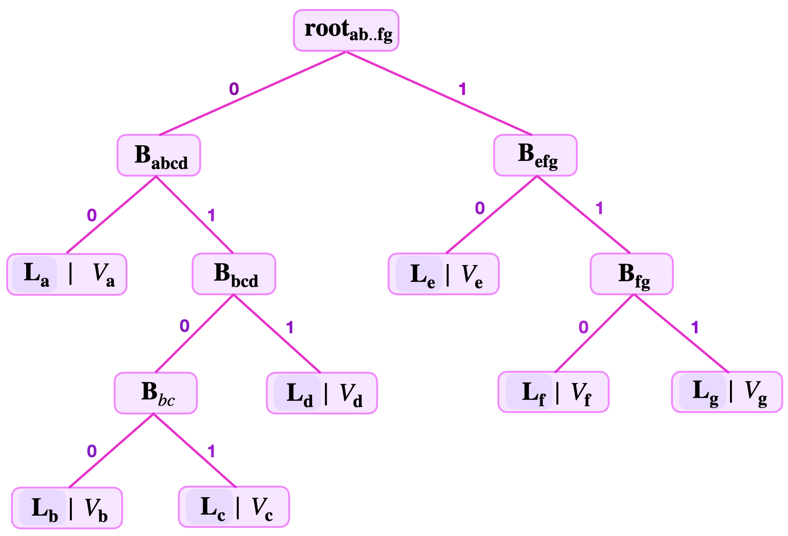
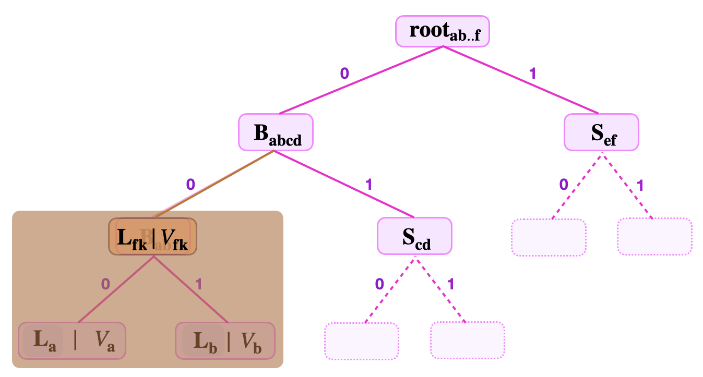
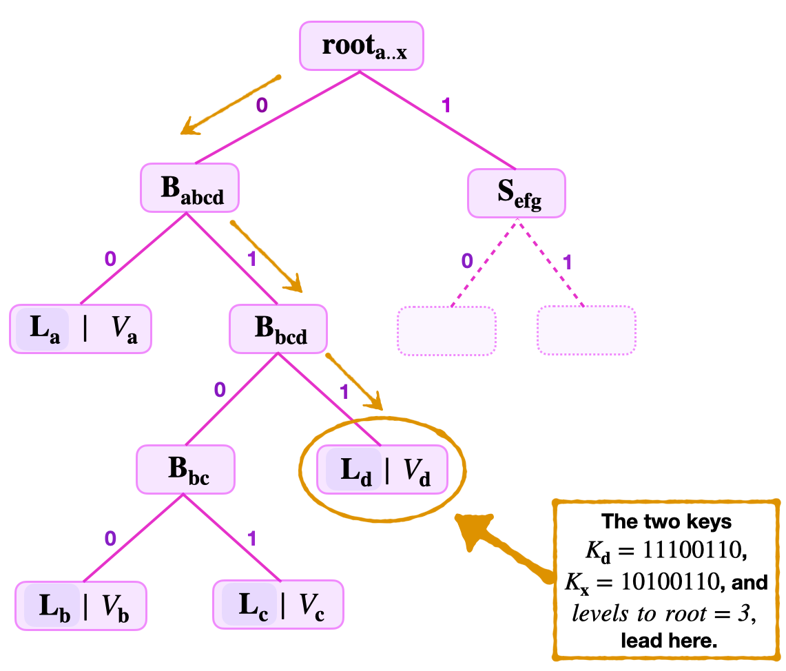
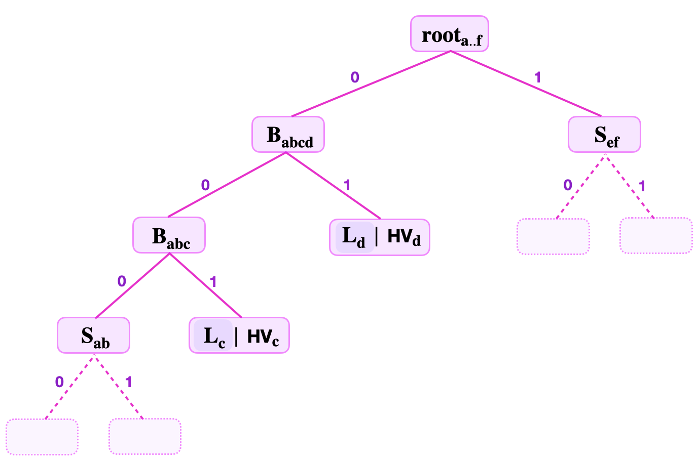

This document covers more concepts needed in understanding our specific design of the zkProver storage using binary SMTs. These concepts also help in elucidating how keys influence the shape of binary SMTs.

First is the level of a leaf. The level of a leaf, $\mathbf{L}_{\mathbf{x}}$, in a binary SMT is defined as the number of edges one traverses when navigating from the root to the leaf. Denote the level of the leaf $\mathbf{L_x}$ by  $\text{lvl}(\mathbf{L_x})$.

## Leaf levels

Consider the below figure for an SMT storing seven key-value pairs, built by following the principles explained in the foregoing subsection;

$$
(\mathbf{K}_{\mathbf{a}}, V_{\mathbf{a}}),\ (\mathbf{K}_{\mathbf{b}}, V_{\mathbf{b}}),\ (\mathbf{K}_{\mathbf{c}}, V_{\mathbf{c}}),\ (\mathbf{K}_{\mathbf{c}}, V_{\mathbf{c}}),\ (\mathbf{K}_{\mathbf{d}}, V_{\mathbf{d}}),\ 
(\mathbf{K}_{\mathbf{e}}, V_{\mathbf{e}}),\ (\mathbf{K}_{\mathbf{f}}, V_{\mathbf{f}})\ \ {\text{and}}\ \ (\mathbf{K}_{\mathbf{g}}, V_{\mathbf{g}})
$$

where the keys are,

$$
\begin{aligned}
&K_{\mathbf{a}} = 10101100, K_{\mathbf{b}} = 10010010, K_{\mathbf{c}} = 10001010, K_{\mathbf{d}} = 11100110,\\ 
&K_{\mathbf{e}} = 11110101, K_{\mathbf{f}} = 10001011, K_{\mathbf{g}} = 00011111.
\end{aligned}
$$

The leaf levels are as follows;

$\text{lvl}(\mathbf{L}_{\mathbf{a}}) = 2$, $\text{lvl}(\mathbf{L}_{\mathbf{b}}) = 4$, $\text{lvl}(\mathbf{L}_{\mathbf{c}}) = 4$, $\text{lvl}(\mathbf{L}_{\mathbf{d}}) = 3$, $\text{lvl}(\mathbf{L}_{\mathbf{e}}) = 2$, $\text{lvl}(\mathbf{L}_{\mathbf{f}}) = 3$ and $\text{lvl}(\mathbf{L}_{\mathbf{g}}) = 3$.

As illustrated, keys basically determine the shape of the SMT. They dictate where respective leaves must be placed when building the SMT.

The main determining factor of the SMT shape is in fact the common key-bits among the keys. For instance, the reason why the leaves $\mathbf{L}_{\mathbf{b}}$ and $\mathbf{L}_{\mathbf{c}}$ have the largest leaf level $4$ is because the two leaves have the longest string of common key-bits "$010$" in the SMT of Figure 6 above.

This explains why different leaves in SMTs can have different levels.

The height of a Merkle tree refers to the largest number of edges traversed when navigating from the root to any leaf. Since all leaves are of the same level in Merkle trees, the concept of a height coincide with that of the level of a leaf for Merkle trees.

But this is not the case for SMTs. Since leaf levels differ from one leaf to another in SMTs, the height of an SMT is not the same as the leaf level.

Rather, the height of an SMT is defined as the largest leaf level among the various leaf levels of leaves on the SMT. For instance, the height of the SMT depicted in the figure above, is $4$.

Now, since all keys have the same fixed key-length, they not only influence SMT leaf levels and shapes, but also restrict SMT heights to the fixed key-length. The maximum height of an SMT is the maximum key-length imposed on all keys.

### Remaining keys

In a general Sparse Merkle tree (SMT), values are stored at their respective leaf-nodes.

But a leaf node $\mathbf{L}_{\mathbf{x}}$ not only stores a value, $V_{\mathbf{x}}$, but also the key-bits that are left unused in the navigation from the root to $\mathbf{L}_{\mathbf{x}}$. These unused key-bits are called the remaining key, and are denoted by $\text{RK}_{\mathbf{x}}$ for the leaf node $\mathbf{L}_{\mathbf{x}}$.

Consider again the SMT of the 7 key-value pairs depicted in the figure above. The remaining keys of each of the 7 leaves in the SMT are as follows;

$\text{RK}_{\mathbf{a}} = 110101$,  $\text{RK}_{\mathbf{b}} = 1001$,  $\text{RK}_{\mathbf{c}} = 0001$,  $\text{RK}_{\mathbf{d}} = 00111$,  $\text{RK}_{\mathbf{e}} = 101111$,  $\text{RK}_{\mathbf{f}} = 10001$  and  $\text{RK}_{\mathbf{g}} = 11000$.

## Fake-leaf attack

Note that the above simplified design of binary SMTs, based on key-value pairs, presents some problems. The characteristic of binary SMTs having leaves at different levels can be problematic to verifiers, especially when carrying out a simple Merkle proof.

### Scenario: Fake SMT leaf

What if the verifier is presented with a fake leaf?

Consider the below figure, showing a binary SMT with a branch $\mathbf{{B}_{ab}}$ and its children $\mathbf{L_{a}}$ and $\mathbf{L_{b}}$ hidden from the verifier's sight.

That is, suppose the verifier is provided with the following information;

- The key-value $(K_{\mathbf{fk}}, V_\mathbf{{fk}})$, where $K_{\mathbf{fk}} = 11010100$ and $V_{\mathbf{fk}} = \mathbf{L_{a}} \| \mathbf{L_{b}}$.
- The root  $\mathbf{{root}_{ab..f}}$ , the number of levels to root, and the siblings $\mathbf{{S}_{\mathbf{cd}}}$ and $\mathbf{{S}_{\mathbf{ef}}}$.

That is, the Attacker claims that some $V_{\mathbf{fk}}$ is stored at $\mathbf{L_{fk}} := \mathbf{{B}_{ab}}$.

Verifier is unaware that $V_{\mathbf{fk}}$ is in fact the concatenated value of the hidden real leaves, $\mathbf{L_{a}}$ and $\mathbf{L_{b}}$, that are children of the *supposed* leaf $\mathbf{L_{fk}}$. i.e., Verifier does not know that leaf $\mathbf{L_{fk}}$ is in fact a branch.

So then, the verifier being unaware that $\mathbf{L_{fk}}$ is not a properly constructed leaf, starts verification as follows;

1. He uses the key $K_{\mathbf{fk}}$ to navigate the tree until locating the supposed leaf $\mathbf{L_{fk}}$.
2. He computes $\mathbf{H}(V_{\mathbf{fk}})$ and sets it as
   $\tilde{\mathbf{L}}_{\mathbf{fk}} := \mathbf{H}(V_{\mathbf{fk}})$.
3. Then takes the sibling $\mathbf{{S}_{\mathbf{cd}}}$ and calculates  
   $\tilde{ \mathbf{B}}_{\mathbf{fkcd}} = \mathbf{H} \big( \tilde{\mathbf{L}}_{\mathbf{fk}} \| \mathbf{S}_{\mathbf{cd}}  \big)$.
4. And then, uses $\tilde{ \mathbf{B}}_{\mathbf{fkcd}}$ to compute the root,  $\tilde{ \mathbf{root}}_{\mathbf{ab..f}} = \mathbf{H} \big( \tilde{ \mathbf{B}}_{\mathbf{fkcd}}\| \mathbf{S}_{\mathbf{ef}} \big)$.

The question is: "Does the fake leaf $\mathbf{L_{fk}}$ pass the verifier's Merkle proof or not?" Or, equivalently: "Is $\tilde{ \mathbf{root}}_{\mathbf{ab..f}}$ equal to $\mathbf{root}_{\mathbf{ab..f}}$?"

Since the actual branch $\mathbf{{B}_{ab}}$ is by construction the hash,
$\mathbf{H}(\mathbf{L_{a}} \| \mathbf{L_{b}})$, then
$\mathbf{{B}_{ab}} = \tilde{\mathbf{L}}_{\mathbf{fk}}$.
The parent branch ${\mathbf{B}}_{\mathbf{abcd}}$ also, being constructed as the hash,
$\mathbf{H} \big( \mathbf{B}_{\mathbf{ab}}\| { \mathbf{S}}_{\mathbf{cd}} \big)$, should be equal to $\mathbf{H} \big( \tilde{\mathbf{L}}_{\mathbf{fk}} \| \mathbf{S}_{\mathbf{cd}}  \big)  = \tilde{ \mathbf{B}}_{\mathbf{fkcd}}$. As a result, $\mathbf{root}_{\mathbf{ab..f}} = \mathbf{H} \big(  {\mathbf{B}}_{\mathbf{abcd}} \| \mathbf{S}_{\mathbf{ef}} \big) = \mathbf{H} \big( \tilde{ \mathbf{B}}_{\mathbf{fkcd}}\| \mathbf{S}_{\mathbf{ef}} \big) = \tilde{ \mathbf{root}}_{\mathbf{ab..f}}$.

Therefore, the fake leaf $\mathbf{L_{fk}}$ passes the Merkle proof.

### Solution to the Fake-leaf attack

In order to circumvent the Fake-Leaf Attack we modify how the binary SMTs are built.

Here's the trick: When building binary SMTs, differentiate between how leaves are hashed and how branches are hashed.

That is, use two different hash functions; one hash function to hash leaves, denote it by $\mathbf{H}_{\mathbf{leaf}}$, and the other function for hashing non-leaf nodes, denote it by $\mathbf{H}_{\mathbf{noleaf}}$.

#### How does this prevent the Fake-leaf attack?

Reconsider now, the Scenario A, given above.  Recall that the Attacker provides the following;

- The key-value $(K_{\mathbf{fk}}, V_\mathbf{{fk}})$, where $K_{\mathbf{fk}} = 11010100$ and $V_{\mathbf{fk}} = \mathbf{L_{a}} \| \mathbf{L_{b}}$.
- The root  $\mathbf{{root}_{ab..f}}$ , the number of levels to root, and the siblings  $\mathbf{{S}_{\mathbf{cd}}}$  and  $\mathbf{{S}_{\mathbf{ef}}}$.

The verifier suspecting no foul, uses $K_{\mathbf{fk}} = 11010100$ to navigate the tree until he finds $V_{\mathbf{fk}}$ stored at $\mathbf{L_{fk}} := \mathbf{{B}_{ab}}$.

He subsequently starts the Merkle proof by hashing the value $\tilde{V}_{\mathbf{fk}}$ stored at the located leaf. Since, this computation amounts to forming a leaf, he uses the leaf-hash function, $\mathbf{H}_{\mathbf{leaf}}$.

- He then sets $\tilde{\mathbf{L}}_{\mathbf{fk}}  :=  \mathbf{H}_{\mathbf{leaf}} \big( V_{\mathbf{fk}} \big) = \mathbf{H}_{\mathbf{leaf}} \big( \mathbf{L_{a}} \| \mathbf{L_{b}} \big)$.
- And further computes  $\tilde{ \mathbf{B}}_{\mathbf{fkcd}} = \mathbf{H}_{\mathbf{noleaf}} \big( \tilde{\mathbf{L}}_{\mathbf{fk}} \| \mathbf{S}_{\mathbf{cd}}  \big)$.
- Again, calculates the root,  $\tilde{ \mathbf{root}}_{\mathbf{ab..f}} = \mathbf{H}_{\mathbf{noleaf}} \big( \tilde{ \mathbf{B}}_{\mathbf{fkcd}}\| \mathbf{S}_{\mathbf{ef}} \big)$.

But the actual branch $\mathbf{{B}_{ab}}$ was constructed with the no-leaf-hash function,
$\mathbf{H}_{\mathbf{noleaf}}$. That is,

$$
\mathbf{{B}_{ab}} = \mathbf{H}_{\mathbf{noleaf}} (\mathbf{L_{a}} \| \mathbf{L_{b}}) \neq \mathbf{H}_{\mathbf{leaf}} \big(\mathbf{L_{a}} \| \mathbf{L_{b}} \big) = \tilde{\mathbf{L}}_{\mathbf{fk}}.
$$

The parent branch ${\mathbf{B}}_{\mathbf{abcd}}$ also, was constructed as, ${\mathbf{B}}_{\mathbf{abcd}} = \mathbf{H}_{\mathbf{noleaf}} \big(\mathbf{B}_{\mathbf{ab}}\| {\mathbf{S}}_{\mathbf{cd}}\big)$.
Since the hash functions used are collision-resistant, ${\mathbf{B}}_{\mathbf{abcd}}$ cannot be equal to $\mathbf{H}_{\mathbf{noleaf}} \big( \tilde{\mathbf{L}}_{\mathbf{fk}} \| \mathbf{S}_{\mathbf{cd}}  \big)  = \tilde{ \mathbf{B}}_{\mathbf{fkcd}}$. Consequently, $\mathbf{root}_{\mathbf{ab..f}}  \neq \tilde{ \mathbf{root}}_{\mathbf{ab..f}}$. Therefore, the Merkle Proof fails.

## Non-binding key-value pairs

Whenever the verifier needs to check inclusion of the given key-value pair $(K_{\mathbf{x}}, \text{V}_{\mathbf{x}})$ in a binary SMT identified by the $\mathbf{{root}_{a..x}}$, he first navigates the SMT in order to locate the leaf $\mathbf{{L}_{x}}$ storing $\text{V}_{\mathbf{x}}$, and thereafter carries out two computations.

Both computations involve climbing the tree from the located leaf $\mathbf{{L}_{x}}$ back to the root, $\mathbf{{root}_{a..x}}$. And the two computations are;

1. Checking correctness of the key $K_{\mathbf{x}}$.
    
    That is, verifier takes the Remaining Key, $\text{RK}_{\mathbf{x}}$, and reconstructs the key $K_{\mathbf{x}}$ by concatenating the key bits used to navigate to $\mathbf{{L}_{x}}$ from $\mathbf{{root}_{a..x}}$, in the reverse order.

    Suppose the number of levels to root is 3, and the least-significant bits used for navigation are $\text{kb}_\mathbf{2}$, $\text{kb}_\mathbf{1}$ and $\text{kb}_\mathbf{0}$.

    In order to check key-correctness, verifier takes the remaining key $\text{RK}$ and,

    - Concatenates $\text{kb}_\mathbf{2}$ and gets $\text{ } \text{RK} \|  \text{kb}_\mathbf{2}$,

    - Concatenates $\text{kb}_\mathbf{1}$ then gets $\text{ } \text{RK} \|  \text{kb}_\mathbf{2} \| \text{kb}_\mathbf{1}$,

    - Concatenates $\text{kb}_\mathbf{0}$ and gets $\text{ }  \text{RK} \|  \text{kb}_\mathbf{2} \| \text{kb}_\mathbf{1} \| \text{kb}_\mathbf{0}$.

    He then sets $\tilde{K}_{\mathbf{x}} := \text{RK} \|  \text{kb}_\mathbf{2} \| \text{kb}_\mathbf{1} \| \text{kb}_\mathbf{0}$, and checks if $\tilde{K}_{\mathbf{x}}$ equals $K_{\mathbf{x}}$.

2. The Merkle proof: That is, checking whether the value stored at the located leaf $\mathbf{{L}_{x}}$ was indeed included in computing the root, $\mathbf{{root}_{a..x}}$.
    
    This computation was illustrated several times in the above discussions. Note that the key-correctness and the Merkle proof are simultaneously carried out.

### Example: Indistinguishable leaves

Suppose a binary SMT contains a key-value pair $(K_{\mathbf{d}}, V_\mathbf{{d}})$ at the leaf $\mathbf{L_{d}}$, where $K_{\mathbf{d}} = 11100110$. That is, $\mathbf{L_{d}} := \mathbf{H_{leaf}}(V_\mathbf{{d}})$.

Note that, when building binary SMTs, it is permissible to have another key-value pair $(K_{\mathbf{x}}, V_\mathbf{{x}})$ in the same tree with $V_\mathbf{{x}} = V_\mathbf{{d}}$.

An Attacker can pick the key-value pair $(K_{\mathbf{x}}, V_\mathbf{{x}})$ such that $V_\mathbf{{x}} = V_\mathbf{{d}}$ and $K_{\mathbf{x}} = 10100110$. And, with the above design, it means  $\mathbf{L_{x}} = \mathbf{H_{leaf}}(V_\mathbf{{x}}) = \mathbf{H_{leaf}}(V_\mathbf{{d}}) =  \mathbf{L_{d}}$.

Consider the below figure and suppose the Attacker provides the following data;

- The key-value $(K_{\mathbf{x}}, V_\mathbf{{x}})$, where
  $K_{\mathbf{x}} = 10100110$ and $V_{\mathbf{x}} = V_\mathbf{d}$.
- The root, $\mathbf{{root}_{a..x}}$, the number of *levels to root* = 3, and the siblings
  $\mathbf{{B}_{\mathbf{bc}}}$, $\mathbf{L_{a}}$ and  $\mathbf{{S}_{\mathbf{efg}}}$.

The verifier uses the least-significant key bits; $\text{kb}_\mathbf{0} = 0$,  $\text{kb}_\mathbf{1} = 1$ and $\text{kb}_\mathbf{2} = 1$; to navigate the tree and locate the leaf $\mathbf{L_{x}}$ which is positioned at $\mathbf{L_{d}}$.

In order to ensure that $\mathbf{L_{x}}$ actually stores the value $V_\mathbf{{x}}$; The verifier first checks key-correctness. He takes the remaining key $\text{RK} = 10100$ and,

1. Concatenates $\text{kb}_\mathbf{2} = 1$, and gets $\text{ } \text{RK} \| \text{kb}_\mathbf{2} = 10100 \|1$,

2. Concatenates $\text{kb}_\mathbf{1} = 0$  to get $\text{ } \text{RK} \| \text{kb}_\mathbf{2} \|  \text{kb}_\mathbf{1} = 10100 \|1\|0$,

3. Concatenates $\text{kb}_\mathbf{0} = 0$, yielding $\text{ }  \text{RK} \| \text{kb}_\mathbf{2} \|  \text{kb}_\mathbf{1} \| \text{kb}_\mathbf{0} = 10100 \|1\|0\|0$.

He sets $\tilde{K}_{\mathbf{x}} := 10100 \|1\|0\|0 = 10100100$. Since $\tilde{K}_{\mathbf{x}}$ equals $K_{\mathbf{x}}$, the verifier concludes that the supplied key is correct.

As the verifier climbs the tree to test key-correctness, he concurrently checks if the value $V_\mathbf{{x}}$ is included in the SMT identified by the given root, $\mathbf{{root}_{a..x}}$. That is, he executes the following computations;

- He computes the hash of $V_\mathbf{{x}}$ and sets it as, $\tilde{\mathbf{L}}_\mathbf{x}:= \mathbf{H_{leaf}}(V_\mathbf{{x}})$.

- Then he uses $\mathbf{{B}_{\mathbf{bc}}}$ to compute, $\tilde{\mathbf{B}}_{\mathbf{bcd}} = \mathbf{H_{noleaf}}(\mathbf{{B}_{\mathbf{bc}}} \|\tilde{\mathbf{L}}_\mathbf{x})$.

- He also uses $\mathbf{L_{a}}$ to compute, $\tilde{\mathbf{B}}_{\mathbf{abcd}} = \mathbf{H_{noleaf}}(\mathbf{L_{a}} \| \tilde{\mathbf{B}}_{\mathbf{bcd}})$.

- He further calculates, $\tilde{\mathbf{root}}_{\mathbf{abcd}} = \mathbf{H_{noleaf}}(\tilde{\mathbf{B}}_{\mathbf{abcd}} \| \mathbf{{S}_{\mathbf{efg}}})$.

Next, the verifier checks if $\tilde{\mathbf{root}}_{\mathbf{abcd}}$ equals $\mathbf{root}_{\mathbf{abcd}}$.

Since $V_\mathbf{{x}} = V_\mathbf{{d}}$, it follows that all the corresponding intermediate values to the root are equal;

- $\mathbf{L_{d}} = \mathbf{H_{leaf}}(V_\mathbf{{d}}) = \mathbf{H_{leaf}}(V_\mathbf{{x}}) = \tilde{\mathbf{L}}_\mathbf{x}$,
- $\mathbf{B}_{\mathbf{bcd}} = \mathbf{H_{noleaf}}(\mathbf{{B}_{\mathbf{bc}}} \| \mathbf{L}_\mathbf{d}) = \mathbf{H_{noleaf}}(\mathbf{{B}_{\mathbf{bc}}} \|\tilde{\mathbf{L}}_\mathbf{x}) = \tilde{\mathbf{B}}_{\mathbf{bcd}}$,
- $\mathbf{B}_{\mathbf{abcd}} = \mathbf{H_{noleaf}}(\mathbf{L_{a}} \| \mathbf{B}_{\mathbf{bcd}} ) = \mathbf{H_{noleaf}}(\mathbf{L_{a}} \| \tilde{\mathbf{B}}_{\mathbf{bcd}} ) = \tilde{\mathbf{B}}_{\mathbf{abcd}}$,
- $\mathbf{root}_{\mathbf{abcd}} = \mathbf{H_{noleaf}}(\mathbf{B}_{\mathbf{abcd}} \| \mathbf{{S}_{\mathbf{efg}}} )  = \mathbf{H_{noleaf}}(\tilde{\mathbf{B}}_{\mathbf{abcd}} \| \mathbf{{S}_{\mathbf{efg}}} ) = \tilde{\mathbf{root}}_{\mathbf{abcd}}$.  

The verifier therefore concludes that the key-value pair $(K_{\mathbf{x}}, V_\mathbf{{x}})$ is in the SMT, when it is not.

### Why is this attack successful?

Note that equality of values, $V_\mathbf{{x}} = V_\mathbf{{d}}$, associated with two distinct keys, has nothing to do with the efficacy of this attack. In fact, for all practical purposes, it should be permissible for distinct leaves to store any value, irrespective of whether other leaves store an equivalent value or not.

The downfall of our binary SMTs design, thus far, is that it does not give the verifier any equation that relates or ties the keys to their associated values.

In other words, the attack succeeds simply because the key-value pairs (as 'committed' values) are not binding.

### Solution to the non-binding key-value problem

The solution to this problem is straightforward, and it is to build the binary SMTs in such a way that the key-value pairs are binding. This means, create a relationship between the keys and their associated values, so that the verifier can simply check if this relationship holds true.

In order to ensure that checking such a relationship blends with the usual proof machinery, one has two options. The naïve solution, which involves the keys, is one option.

#### The Naïve solution

The naïve solution is to simply include keys in the argument of the hash function, when forming leaves.

That is, when building a binary SMT, one includes a key-value pair $(K_{\mathbf{x}}, V_\mathbf{{x}})$ by setting the leaf $\mathbf{L_{x}}$ to be the hash of both the value and the key;

$$
\mathbf{L_{x}} = \mathbf{H_{leaf}}(K_{\mathbf{x}} \| V_\mathbf{{x}} )
$$

**Does this change remedy the non-binding problem?**

Suppose $(K_{\mathbf{x}}, V_\mathbf{{x}})$ and $(K_{\mathbf{z}}, V_\mathbf{{z}})$ are two key-value pairs such that $V_\mathbf{{x}} = V_\mathbf{{z}}$ , while $K_\mathbf{{x}}$ and $K_\mathbf{{z}}$ differ only in one of the most-significant bits.

Since the hash functions used are collision-resistant, it follows that

$$
\mathbf{L_{x}} = \mathbf{H_{leaf}}(K_{\mathbf{x}} \| V_\mathbf{{x}}) \neq \mathbf{H_{leaf}}(K_{\mathbf{z}} \| V_\mathbf{{z}}) = \mathbf{L_{z}}
$$

Consequently, although the key-value pairs $(K_{\mathbf{x}}, V_\mathbf{{x}})$ and $(K_{\mathbf{z}}, V_\mathbf{{z}})$ might falsely pass the key-correctness check, they do not pass the Merkle proof test. And this is because, collision-resistance also guarantees that the following series of inequalities hold true;

$$
\begin{aligned}
\mathbf{L_{x}} = \mathbf{H_{leaf}}(K_{\mathbf{x}} \| V_\mathbf{{x}}) \neq \mathbf{H_{leaf}}(K_{\mathbf{z}} \| V_\mathbf{{z}}) = \mathbf{L_{z}} \\
\\
\mathbf{B_{bx}} = \mathbf{H_{noleaf}}(\mathbf{S}_\mathbf{{b}} \| \mathbf{L}_{\mathbf{x}}) \neq \mathbf{H_{noleaf}}(\mathbf{S}'_\mathbf{{b}} \| \mathbf{L}_{\mathbf{z}}) = \mathbf{B_{bz}} \\
\\
\mathbf{B_{abx}} = \mathbf{H_{noleaf}}(\mathbf{S}_\mathbf{{a}} \| \mathbf{B_{bx}} ) \neq \mathbf{H_{noleaf}}(\mathbf{S}'_\mathbf{{a}} \| \mathbf{B_{bz}}) = \mathbf{B_{abz}}
\end{aligned}
$$

where; $\mathbf{S}_\mathbf{{b}}$ is a sibling to $\mathbf{L}_{\mathbf{x}}$ and $\mathbf{S}_\mathbf{{a}}$ is a sibling to $\mathbf{B_{bx}}$, making $\mathbf{B_{bx}}$ and $\mathbf{B_{abx}}$ branches traversed while climbing the tree from $\mathbf{L_{x}}$ to root; Similarly,  $\mathbf{S}'_\mathbf{{b}}$ is a sibling to $\mathbf{L}_{\mathbf{z}}$, while $\mathbf{S}'_\mathbf{{a}}$ is a sibling to $\mathbf{B_{bx}}$, also making $\mathbf{B_{bz}}$ and $\mathbf{B_{abz}}$ branches traversed while climbing the tree from $\mathbf{L_{z}}$ to root.

The only chance for the Merkle proof to pass is if the key-value pairs $(K_{\mathbf{x}}, V_\mathbf{{x}})$ and $(K_{\mathbf{z}}, V_\mathbf{{z}})$ are distinct and are individually on the same SMT.

The inclusion of keys, in the argument of the hash functions, therefore ensures that leaves $\mathbf{L_{x}}$ and $\mathbf{L_{z}}$ are distinguishable. And most importantly, that key-value pairs in our SMTs are now binding.

#### A better solution

The other solution, which is much more apt than the Naïve option, utilises the remaining keys when forming leaves.

Since *levels to root* is related to the *Remaining Key* ($\text{RK}$) notion, a much more apt solution is to rather include the remaining key, $\text{RK}_\mathbf{x}$, as the argument to the hash function, instead of the whole key $K_{\mathbf{x}}$.

That is, for a key-value pair $(K_{\mathbf{x}}, V_\mathbf{{x}})$, one sets the leaf $\mathbf{L_{x}}$ to be the hash of both the value and the remaining key;

$$
\mathbf{L_{x}} = \mathbf{H_{leaf}}( \text{RK}_\mathbf{x}  \| \text{V}_\mathbf{{x}}).
$$

With this strategy, the verifier needs the remaining key $\text{RK}_\mathbf{{x}}$ , instead of the whole key, in order to carry out a Merkle proof. So he adjusts the Merkle proof by;

- Firstly, picking the correct hash function $\mathbf{H_{leaf}}$ for leaves,
- Secondly, concatenating the value $V_{\mathbf{x}}$ stored at the leaf $L_{\mathbf{x}}$ and the remaining key $\text{RK}_\mathbf{{x}}$, instead of the whole key $K_{\mathbf{x}}$,
- Thirdly, hashing the concatenation $\mathbf{H_{leaf}}( \text{RK}_\mathbf{x}  \| \text{V}_\mathbf{{x}}) =: \mathbf{L_{x}}$.

This approach not only ensures that key-value pairs in our SMTs are now binding, but also implicitly 'encodes' the levels to root in the leaf.

The strategy of using the $\text{RK}_\mathbf{x}$ instead of the key $K_{\mathbf{x}}$, coupled with hashing leaves and branches differently, yields sound verification.

## Hiding values

It is often necessary to ensure that a commitment scheme has the hiding property.
And this can be achieved by storing hashes of values, as opposed to plainly storing the values.

A leaf therefore is henceforth constructed in two steps;

- Firstly, for a key-value pair $(K_{\mathbf{x}}, V_\mathbf{{x}})$, compute the hash the value $V_\mathbf{{x}}$,

$$
\text{Hashed Value} = \text{HV}_\mathbf{{x}} = \mathbf{H_{noleaf}}(V_\mathbf{{x}})
$$

- Secondly, form the leaf containing $V_\mathbf{{x}}$, as follows,

$$
\mathbf{L_{x}} = \mathbf{H_{leaf}}(  \text{RK}_\mathbf{x}  \| \text{HV}_\mathbf{{x}})
$$

Since it is infeasible to compute the preimage of the hash functions, $\mathbf{H_{leaf}}$ and $\mathbf{H_{noleaf}}$, computing the hash of the value $V_\mathbf{{x}}$ amounts to 'encrypting'.

The prover therefore achieves zero-knowledge by providing the pair, $(K_{\mathbf{x}}, \text{HV}_\mathbf{{x}})$, as the key-value pair instead of the explicit one, $(K_{\mathbf{x}}, V_\mathbf{{x}})$.

The verifier, on the other hand, has to adjust the Merkle proof by starting with;

- Firstly, picking the correct hash function $\mathbf{H_{leaf}}$ for leaf nodes,
- Secondly, concatenating the hashed-value $\text{HV}_\mathbf{{x}}$ and the remaining key $\text{RK}_\mathbf{{x}}$,
- Thirdly, hashing the concatenation in order to form the leaf, $\mathbf{L_{x}} := \mathbf{H_{leaf}}( \text{RK}_\mathbf{x}  \| \text{HV}_\mathbf{{x}})$.

### Example. (Merkle proof on hidden values)

The following example illustrates a Merkle proof when the above strategy is applied.

Consider an SMT where the keys are 8-bit long, and the prover commits to the key-value $( K_{\mathbf{c}} , \text{HV}_{\mathbf{c}} )$ with $K_{\mathbf{c}} = 10010100$. See figure below.

Since the levels to root is 3, the prover provides; the least-significant key-bits, $\text{kb}_0 = 0$, $\text{kb}_1 = 0$, $\text{kb}_2 = 1$, the stored hashed-value $\text{HV}_{\mathbf{c}}$, the root  $\mathbf{{root}_{a..f}}$, the Remaining Key $\mathbf{ \text{RK}_{\mathbf{c}}} = 10010$, and the siblings $\mathbf{{S}_{ab}}$, $\mathbf{{L}_{d}}$ and $\mathbf{{S}_{\mathbf{ef}}}$.

The verifier first uses the least-significant bits of the key $K_{\mathbf{c}} = 10010100$ to navigate the SMT from the root, $\mathbf{{root}_{a..f}}$, to the leaf $\mathbf{L_c}$. Then, he executes the following computations;

1. He computes, $\mathbf{L_c} = \mathbf{H_{leaf}}\big( \mathbf{ \text{RK}_{\mathbf{c}}} \| \text{HV}_{\mathbf{c}} \big) = \mathbf{H_{leaf}}( 10010 \| \text{HV}_{\mathbf{c}})$

2. Then, he uses the sibling $\mathbf{{S}_{ab}}$ to compute, $\tilde{ \mathbf{B}}_{\mathbf{abc}} := \mathbf{H_{noleaf}} \big( \mathbf{{S}_{ab}}\|\mathbf{L}_{\mathbf{c}} \big)$.

3. Next, he computes, $\tilde{ \mathbf{B}}_{\mathbf{abcd}} := \mathbf{H_{noleaf}} \big( \tilde{ \mathbf{B}}_{\mathbf{abc}} \| \mathbf{L}_{\mathbf{d}} \big)$.

4. Now, verifier uses $\tilde{ \mathbf{B}}_{\mathbf{abcd}}$ to compute the *supposed* root,  $\tilde{ \mathbf{root}}_{\mathbf{ab..f}}  := \mathbf{H_{noleaf}} \big( \tilde{ \mathbf{B}}_{\mathbf{abcd}}\| \mathbf{S}_{\mathbf{ef}} \big)$.

5. Checks if $\tilde{ \mathbf{root}}_{\mathbf{ab..f}}$ equals ${ \mathbf{root}}_{\mathbf{ab..f}}$.

The verifier accepts that the key-value pair $( K_{\mathbf{c}} , V_{\mathbf{c}} )$ is in the SMT only if  $\tilde{ \mathbf{root}}_{\mathbf{ab..f}} = { \mathbf{root}}_{\mathbf{ab..f}}$. And he does this without any clue about the exact value $V_{\mathbf{c}}$ which is hidden as $\text{HV}_{\mathbf{c}}$.
