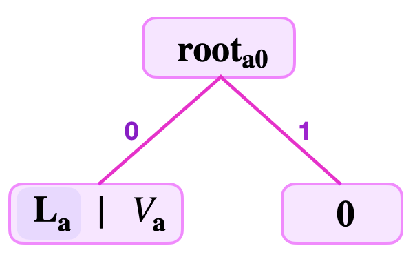
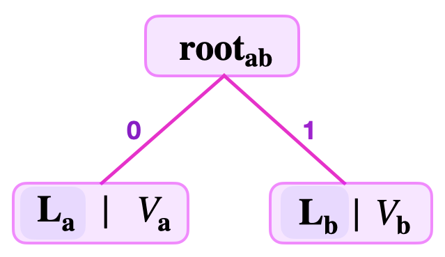
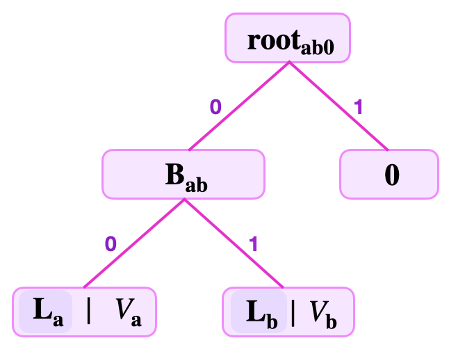
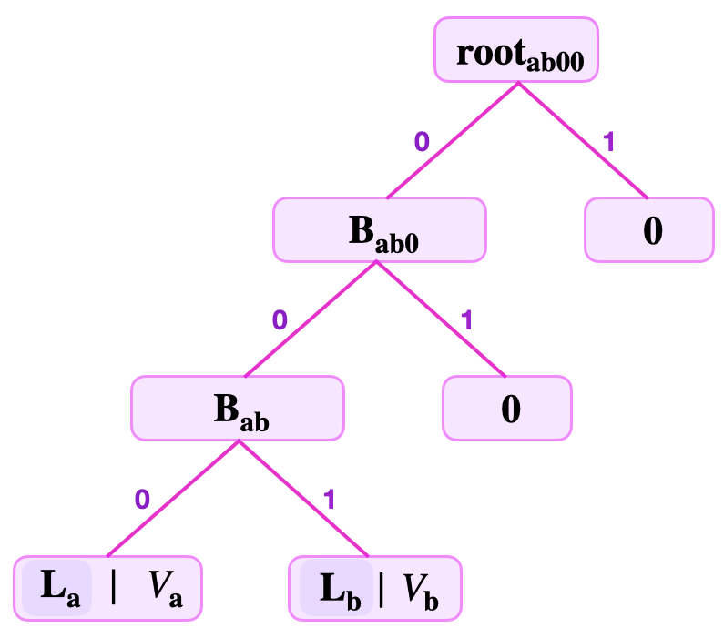

Understanding the finer details of how the Storage SM operates requires a good grasp of the way the zkProver's Sparse Merkle Trees (SMTs) are constructed. This document explains how these SMTs are built.

Consider key-value pair based binary SMTs. The focus here is on explaining how to construct an SMT that represents a given set of key-value pairs. And, for the sake of simplicity, we assume 8-bit key-lengths.

A NULL or **empty** SMT has a zero root. That is, it has no key and no value recorded in it. Similarly, a zero node or NULL node refers to a node that carries no value.

## A binary SMT with one key-value pair

A binary SMT with a **single key-value pair** $(K_{\mathbf{a}}, \text{V}_{\mathbf{a}})$, is built as follows.

Suppose that $K_{\mathbf{a}} = 11010110$. In order to build a binary SMT with this single key-value $(K_{\mathbf{a}}, \text{V}_{\mathbf{a}})$,

1. One computes the hash $\mathbf{H}( \text{V}_{\mathbf{a}})$ of the value $\text{V}_{\mathbf{a}}$,

2. Sets the leaf $\mathbf{L}_{\mathbf{a}} := \mathbf{H}( \text{V}_{\mathbf{a}})$,

3. Sets the sibling leaf as a NULL leaf, simply represented as "$\mathbf{0}$",

4. Computes the root as  $\mathbf{root}_{a0} = \mathbf{H}(\mathbf{L}_{\mathbf{a}} \| \mathbf{0} )$, with the leaf $\mathbf{L}_{\mathbf{a}}$ on the left because the $\text{lsb}(K_{\mathbf{a}}) = 0$. That is, between the two edges leading up to the root, the leaf $\mathbf{L}_{\mathbf{a}}$ is on the left edge, while the NULL leaf "$\mathbf{0}$" is on the right.

See the below figure for the SMT representing the single key-value pair $(K_{\mathbf{a}}, \text{V}_{\mathbf{a}})$, where  $K_{\mathbf{a}} = 11010110$.

Note that the last nodes in binary SMT branches are generally either leaves or zero-nodes.

In the case where the least-significant bit, **lsb of $K_{\mathbf{a}}$ is $1$**, the SMT with a single key-value pair $(K_{\mathbf{a}}, \text{V}_{\mathbf{a}})$ would be a mirror image of what is seen in Figure 3. And its root,  $\mathbf{root}_{0a} = \mathbf{H}( \mathbf{0}\| \mathbf{L}_{\mathbf{a}}  ) \neq \mathbf{root}_{a0}$ because $\mathbf{H}$ is a collision-resistant hash function.

This example also explains why we need a zero node. Since all trees used in our design are **binary** SMTs, a zero node is used as a default sibling for computing the parent node. This helps to differentiate between roots (also between parent nodes) because a root node actually identifies an SMT. Therefore, it is crucial to distinguish between  $\mathbf{root}_{a0} = \mathbf{H}(\mathbf{L}_{\mathbf{a}} \| \mathbf{0} )$ and $\mathbf{root}_{0a} = \mathbf{H}( \mathbf{0}\| \mathbf{L}_{\mathbf{a}})$ because they represent two distinct trees.

## Binary SMTs with two key-value pairs

Consider now SMTs with **two key-value pairs**, $(K_{\mathbf{a}}, \text{V}_{\mathbf{a}})$ and $(K_{\mathbf{b}}, \text{V}_{\mathbf{b}})$.

There are three distinct cases of how corresponding SMTs can be built, each determined by the keys, $K_{\mathbf{a}}$ and $K_{\mathbf{b}}$.

### Case 1

The keys are such that the $\text{lsb}(K_{\mathbf{a}}) = 0$ and the $\text{lsb}(K_{\mathbf{b}}) = 1$.

Suppose that the keys are given as $K_{\mathbf{a}} = 11010110$ and $K_{\mathbf{b}} = 11010101$.

To build a binary SMT with this two key-values, $(K_{\mathbf{a}}, \text{V}_{\mathbf{a}})$ and $(K_{\mathbf{b}}, \text{V}_{\mathbf{b}})$,

1. One computes the hashes, $\mathbf{H}(\text{V}_{\mathbf{a}})$ and $\mathbf{H}( \text{V}_{\mathbf{b}})$ of the values, $\text{V}_{\mathbf{a}}$ and $\text{V}_{\mathbf{b}}$ , respectively,

2. Sets the leaves, $\mathbf{L}_{\mathbf{a}} := \mathbf{H}( \text{V}_{\mathbf{a}})$ and $\mathbf{L}_{\mathbf{b}} := \mathbf{H}( \text{V}_{\mathbf{b}})$,

3. Checks if the $\text{lsb}(K_{\mathbf{a}})$ differs from the $\text{lsb}(K_{\mathbf{b}})$,

4. Since the $\text{lsb}(K_{\mathbf{a}}) = 0$ and the $\text{lsb}(K_{\mathbf{b}}) = 1$, it means **the two leaves can be siblings**,

5. One can then compute the root as, $\mathbf{root}_{\mathbf{ab}} = \mathbf{H}(\mathbf{L}_{\mathbf{a}} \| \mathbf{L}_{\mathbf{b}})$.

Note that the leaf $\mathbf{L}_{\mathbf{a}}$ is on the left because the $\text{lsb}(K_{\mathbf{a}}) = 0$, but $\mathbf{L}_{\mathbf{b}}$ is on the right because the $\text{lsb}(K_{\mathbf{b}}) = 1$. That is, between **the two edges leading up to the $\mathbf{root}_{\mathbf{ab}}$**, the leaf $\mathbf{L}_{\mathbf{a}}$ must be on the edge from the left, while $\mathbf{L}_{\mathbf{b}}$ is on the edge from the right.

See the below figure for the SMT representing the two key-value pairs $(K_{\mathbf{a}}, \text{V}_{\mathbf{a}})$ and $(K_{\mathbf{b}}, \text{V}_{\mathbf{b}})$, where $K_{\mathbf{a}} = 11010110$ and $K_{\mathbf{b}} = 11010101$.

### Case 2

Both keys end with the same key-bit. That is, the $\text{lsb}(K_{\mathbf{a}}) = \text{lsb}(K_{\mathbf{b}})$, but their second least-significant bits differ.

Suppose that the two keys are given as $K_{\mathbf{a}} = 11010100$ and $K_{\mathbf{b}} = 11010110$.

To build a binary SMT with this two key-values, $(K_{\mathbf{a}}, \text{V}_{\mathbf{a}})$ and $(K_{\mathbf{b}}, \text{V}_{\mathbf{b}})$;

1. One computes the hashes, $\mathbf{H}(\text{V}_{\mathbf{a}})$ and $\mathbf{H}( \text{V}_{\mathbf{b}})$ of the values, $\text{V}_{\mathbf{a}}$ and $\text{V}_{\mathbf{b}}$ , respectively.

2. Sets the leaves, $\mathbf{L}_{\mathbf{a}} := \mathbf{H}( \text{V}_{\mathbf{a}})$ and $\mathbf{L}_{\mathbf{b}} := \mathbf{H}( \text{V}_{\mathbf{b}})$.

3. Checks if the $\text{lsb}(K_{\mathbf{a}})$ differs from the $\text{lsb}(K_{\mathbf{b}})$. Since the $\text{lsb}(K_{\mathbf{a}}) = 0$ and the $\text{lsb}(K_{\mathbf{b}}) = 0$, it means ***the two leaves cannot be siblings*** at this position because it would otherwise mean they share the same tree-address `0`, which is not allowed.

4. One continues to check if the second least-significant bits of $K_{\mathbf{a}}$ and $K_{\mathbf{b}}$ differ. Since the $\text{second lsb}(K_{\mathbf{a}}) = 0$ and the $\text{second lsb}(K_{\mathbf{b}}) = 1$, it means **the two leaves $\mathbf{L}_{\mathbf{a}}$ and $\mathbf{L}_{\mathbf{b}}$ can be siblings** at their respective tree-addresses, `00` and `10`.

5. Next is to compute the hash $\mathbf{H}(\mathbf{L}_{\mathbf{a}} \| \mathbf{L}_{\mathbf{b}})$ and set it as the branch $\mathbf{B}_{\mathbf{ab}} := \mathbf{H}(\mathbf{L}_{\mathbf{a}} \| \mathbf{L}_{\mathbf{b}})$ at the tree-address `0`. Note that the leaf $\mathbf{L}_{\mathbf{a}}$ is on the left because the $\text{second  lsb}(K_{\mathbf{a}}) = 0$, while $\mathbf{L}_{\mathbf{b}}$ is on the right because the $\text{second  lsb}(K_{\mathbf{b}}) = 1$.

6. The branch $\mathbf{B}_{\mathbf{ab}} := \mathbf{H}(\mathbf{L}_{\mathbf{a}} \| \mathbf{L}_{\mathbf{b}})$ needs a sibling. Since all the values, $\text{V}_{\mathbf{a}}$ and $\text{V}_{\mathbf{b}}$, are already represented in the tree at $\mathbf{L}_{\mathbf{a}}$ and $\mathbf{L}_{\mathbf{b}}$, respectively, one therefore sets a NULL leaf "$\mathbf{0}$" as the sibling leaf to $\mathbf{B}_{\mathbf{ab}}$.

7. As a result, it is possible to compute the root as, $\mathbf{root}_{\mathbf{ab0}} = \mathbf{H}(\mathbf{B}_{\mathbf{ab}} \| \mathbf{0})$. Note that, the branch $\mathbf{B}_{\mathbf{ab}}$ is on the left because the $\text{lsb}(K_{\mathbf{a}}) = 0$, and $\mathbf{0}$ must therefore be on the right. That is, between *the two edges leading up to the $\mathbf{root}_{\mathbf{ab0}}$*, the branch $\mathbf{B}_{\mathbf{ab}}$ must be on the edge from the left, while $\mathbf{0}$ is on the edge from the right.

See the below figure depicting the SMT representing the two key-value pairs $(K_{\mathbf{a}}, \text{V}_{\mathbf{a}})$ and $(K_{\mathbf{b}}, \text{V}_{\mathbf{b}})$, where  $K_{\mathbf{a}} = 11010100$ and $K_{\mathbf{b}} = 11010110$.

### Case 3

The first two least-significant bits of both keys are the same, but their third least-significant bits differ.

Suppose that the two keys are given as $K_{\mathbf{a}} = 11011000$ and $K_{\mathbf{b}} = 10010100$. The process for building a binary SMT with these two key-values, $(K_{\mathbf{a}}, \text{V}_{\mathbf{a}})$ and $(K_{\mathbf{b}}, \text{V}_{\mathbf{b}})$ is the same as in Case 2;

1. One computes the hashes, $\mathbf{H}(\text{V}_{\mathbf{a}})$ and $\mathbf{H}( \text{V}_{\mathbf{b}})$ of the values, $\text{V}_{\mathbf{a}}$ and $\text{V}_{\mathbf{b}}$ , respectively.

2. Sets the leaves, $\mathbf{L}_{\mathbf{a}} := \mathbf{H}( \text{V}_{\mathbf{a}})$ and $\mathbf{L}_{\mathbf{b}} := \mathbf{H}( \text{V}_{\mathbf{b}})$.

3. Checks if the $\text{lsb}(K_{\mathbf{a}})$ differs from the $\text{lsb}(K_{\mathbf{b}})$. Since the $\text{lsb}(K_{\mathbf{a}}) = 0$ and the $\text{lsb}(K_{\mathbf{b}}) = 0$, it means **the two leaves cannot be siblings** at this position as it would otherwise mean they share the same tree-address `0`, which is not allowed.

4. Next verifier continues to check if the second least-significant bits of $K_{\mathbf{a}}$ and $K_{\mathbf{b}}$ differ. Since the $\text{second lsb}(K_{\mathbf{a}}) = 0$  and the $\text{second lsb}(K_{\mathbf{b}}) = 0$, it means **the two leaves cannot be siblings** at this position, because it would otherwise mean they share the same tree-address `00`, which is not allowed.

5. Once again he checks if the third least-significant bits of $K_{\mathbf{a}}$ and $K_{\mathbf{b}}$ differ. Since the $\text{third lsb}(K_{\mathbf{a}}) = 0$ and the $\text{third  lsb}(K_{\mathbf{b}}) = 1$, it means **the two leaves $\mathbf{L}_{\mathbf{a}}$ and $\mathbf{L}_{\mathbf{b}}$ can be siblings** at their respective tree-addresses, `000` and `100`.

6. One then computes the hash $\mathbf{H}(\mathbf{L}_{\mathbf{a}} \| \mathbf{L}_{\mathbf{b}})$, and sets it as the branch $\mathbf{B}_{\mathbf{ab}} := \mathbf{H}(\mathbf{L}_{\mathbf{a}} \| \mathbf{L}_{\mathbf{b}})$ at the tree-address `00`. The leaf $\mathbf{L}_{\mathbf{a}}$ is on the left because the third $\text{lsb}(K_{\mathbf{a}}) = 0$, while $\mathbf{L}_{\mathbf{b}}$ is on the right because the third $\text{lsb}(K_{\mathbf{b}}) = 1$.

7. The branch $\mathbf{B}_{\mathbf{ab}} := \mathbf{H}(\mathbf{L}_{\mathbf{a}} \| \mathbf{L}_{\mathbf{b}})$ needs a sibling. Since all the values, $\text{V}_{\mathbf{a}}$ and $\text{V}_{\mathbf{b}}$ , are already represented in the tree at $\mathbf{L}_{\mathbf{a}}$ and $\mathbf{L}_{\mathbf{b}}$, respectively, one therefore sets a NULL leaf "$\mathbf{0}$" as the sibling leaf to $\mathbf{B}_{\mathbf{ab}}$.

8. One can now compute the hash $\mathbf{H}(\mathbf{B}_{\mathbf{ab}} \| \mathbf{0})$, and set it as the branch $\mathbf{B}_{\mathbf{ab0}} := \mathbf{H}(\mathbf{B}_{\mathbf{ab}} \| \mathbf{0})$ at the tree-address `0`. The hash is computed with the branch $\mathbf{B}_{\mathbf{ab}}$ on the left because the second lsb of both keys, $K_{\mathbf{a}}$ and $K_{\mathbf{b}}$, equals $0$. Therefore the NULL leaf "$\mathbf{0}$" must be on the right as an argument to the hash.

9. The branch $\mathbf{B}_{\mathbf{ab0}} := \mathbf{H}(\mathbf{B}_{\mathbf{ab}} \| \mathbf{0})$ also needs a sibling. For the same reason given above, one sets a NULL leaf "$\mathbf{0}$" as the sibling leaf to $\mathbf{B}_{\mathbf{ab0}}$.

10. Now, one is able to compute the root as $\mathbf{root}_{\mathbf{ab00}} = \mathbf{H}(\mathbf{B}_{\mathbf{ab0}} \| \mathbf{0})$. Note that the hash is computed with the branch $\mathbf{B}_{\mathbf{ab0}}$ on the left because the lsb of both keys, $K_{\mathbf{a}}$ and $K_{\mathbf{b}}$, equals $0$. That is, between *the two edges leading up to the $\mathbf{root}_{\mathbf{ab00}}$*, the branch $\mathbf{B}_{\mathbf{ab0}}$ must be on the edge from the left, while "$\mathbf{0}$" is on the edge from the right.

See the below figure depicting the SMT representing the two key-value pairs $(K_{\mathbf{a}}, \text{V}_{\mathbf{a}})$ and $(K_{\mathbf{b}}, \text{V}_{\mathbf{b}})$, where  $K_{\mathbf{a}} = 11011000$ and $K_{\mathbf{b}} = 10010100$.

There are several other SMTs of two key-value pairs $(K_{\mathbf{x}}, \text{V}_{\mathbf{x}})$ and $(K_{\mathbf{z}}, \text{V}_{\mathbf{z}})$ that can be constructed depending on how long the strings of the common least-significant bits between $K_{\mathbf{x}}$ and $K_{\mathbf{z}}$ are.

In general, when building an SMT, leaves of key-value pairs with the same least-significant key-bits share the same navigational path only until any of the corresponding key-bits differ. These common strings of key-bits dictate where the leaf storing the corresponding value is located in the tree.
