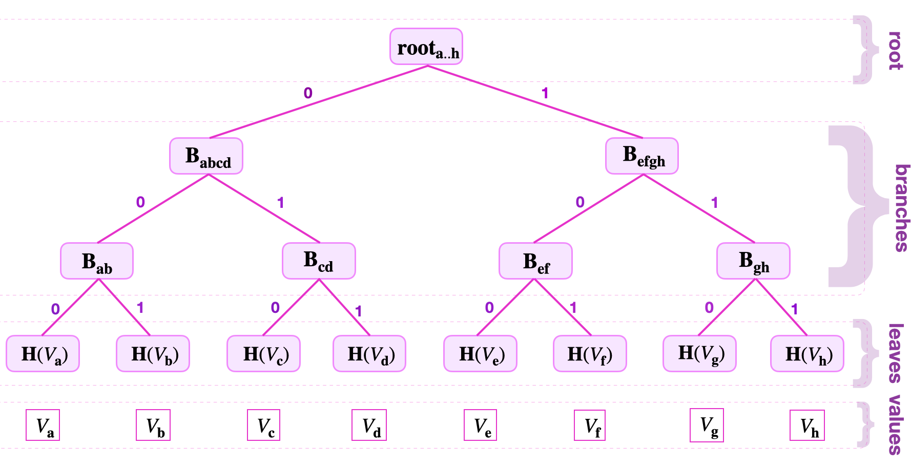

zkProver's data is stored in the form of a special **Sparse Merkle Tree (SMT), which is a tree that combines the concept of a Merkle Tree and that of a Patricia tree**. The design is based on how the Sparse Merkle Trees are constructed and how they store **keys** and **values**.

!!!tip
    The content of this document is rather elementary. Experienced developers can fast-forward to later sections and only refer back as the need arises.

A typical Merkle tree has **leaves**, **branches** and a **root**. A leaf is a node with no child-nodes, while a branch is a node with child-nodes. The root is therefore the node with no parent-node.

See the below figure for an example of how a hash function $\mathbf{H}$ is used to create a Merkle tree recording eight values;

$$
\text{V}_{\mathbf{a}}, \text{V}_{\mathbf{b}}, \text{V}_{\mathbf{c}}, \text{V}_{\mathbf{d}}, \text{V}_{\mathbf{e}}, \text{V}_{\mathbf{f}}, \text{V}_{\mathbf{g}}, \text{V}_{\mathbf{h}}
$$

Firstly, each leaf is nothing but the hash value $\mathbf{H}(\text{V}_{\mathbf{i}})$ of a particular value $\text{V}_{\mathbf{i}}$, where $\mathbf{i}$ is an element of the index-set $\{ \mathbf{a}, \mathbf{b}, \mathbf{c}, \mathbf{d}, \mathbf{e}, \mathbf{f}, \mathbf{g}, \mathbf{h} \}$.

Secondly, the branch nodes are computed as follows;

$$
\mathbf{B}_{\mathbf{ab}} = \mathbf{H} \big(\mathbf{H}(\text{V}_{\mathbf{a}})\| \mathbf{H}(\text{V}_{\mathbf{b}})\big), \\
\mathbf{B}_{\mathbf{cd}} = \mathbf{H} \big(\mathbf{H}(\text{V}_{\mathbf{c}})\| \mathbf{H}(\text{V}_{\mathbf{d}})\big), \\  
\mathbf{B}_{\mathbf{ef}} = \mathbf{H} \big(\mathbf{H}(\text{V}_{\mathbf{e}})\| \mathbf{H}(\text{V}_{\mathbf{f}})\big),\text{ } \\  
\mathbf{B}_{\mathbf{gh}} = \mathbf{H} \big(\mathbf{H}(\text{V}_{\mathbf{g}})\| \mathbf{H}(\text{V}_{\mathbf{h}})\big), \\
\mathbf{B}_{\mathbf{abcd}} = \mathbf{H} \big(\mathbf{B}_{\mathbf{ab}}\| \mathbf{B}_{\mathbf{cd}}\big), \text{}  \text{and} \\
\mathbf{B}_{\mathbf{efgh}} = \mathbf{H} \big( \mathbf{B}_{\mathbf{ef}}\| \mathbf{B}_{\mathbf{gh}}\big). \quad \text{ } \text{ } \text{ }
$$

Thirdly, the root is computed as $\mathbf{root}_{\mathbf{a..h}} = \mathbf{H} \big(\mathbf{B}_{\mathbf{abcd}}\| \mathbf{B}_{\mathbf{efgh}} \big)$.

Leaves that share a parent-node are called **siblings**. The same terminology applies to branches. For example, $\mathbf{B}_{\mathbf{ab}}$ and $\mathbf{B}_{\mathbf{cd}}$ are sibling branches because they are branches of the same parent, $\mathbf{B}_{\mathbf{abcd}}$. Similarly, $\mathbf{B}_{\mathbf{efgh}}$ and $\mathbf{B}_{\mathbf{abcd}}$ are sibling branches.

## Keys and navigating a Merkle tree

Note the bits used to label edges in figure above. The strings of these bits are called **Keys**, and they indicated where a node is located in a Merkle Tree. Since these keys uniquely locate nodes, they are used to navigate from the root to the leaves (and backwards).

Suppose one is given the key-value pair $( K_{\mathbf{d}} , V_{\mathbf{d}})$, where the key is $K_{\mathbf{d}} = 10010110$.

In order to locate the key-value pair $( K_{\mathbf{d}} , V_{\mathbf{d}})$ in the Merkle depicted in the figure above, the key $K_{\mathbf{d}}$ is read bit-by-bit from the right-most bit to the left-most bit. While traversing the tree ***from the root downwards***,

- a zero-key-bit "$0$" means "**follow the edge going to the left**",

- a key-bit "$1$" means "**follow the edge going to the right**".

Since $K_{\mathbf{d} } = 10010110$, as follows:

1. Read the least-significant bit of $K_{\mathbf{d}}$, which is $0$, hence traverse the tree to the left, and reach $\mathbf{B_{abcd}}$.
2. Then read the second significant key-bit, which is "$1$" in this case. So take the edge going to the right, reaching $\mathbf{B_{cd}}$.
3. Again, read the next key-bit, which is "$1$", hence follow the edge going to the right, reaching the leaf $\mathbf{H}( V_{\mathbf{d}} )$.

Since $\mathbf{H}( V_{\mathbf{d}})$ is a leaf and not a branch, and the navigation was correctly done with respect to the given key $K_{\mathbf{d}}$, the $\mathbf{H}( V_{\mathbf{d}})$ must be the leaf storing the value $V_{\mathbf{d}}$.

One can similarly **climb** the tree, going in the reverse direction, by using the key-bits of the given key in the reverse order. That is, starting with the last key-bit used to reach the leaf and ending with the least-significant bit of the key.

The **tree-address** of the value $V_{\mathbf{x}}$, herein refers to the position of the leaf $L_{\mathbf{x}} := \mathbf{H}( V_{\mathbf{x}})$, denoted by the key-bits used to reach $L_{\mathbf{d}}$ but in the reverse order.

In the above example, the tree-address of $V_{\mathbf{d}}$ is `011`.

## A Merkle proof example

Merkle Trees can be used as commitment schemes. And here is an example that follows the (key,value)-pair approach used in the zkProver. Consider the Merkle Tree shown in the figure above.

If the prover has committed to a value $\text{V}_{\mathbf{f}}$ by appending a new leaf $\mathbf{H}(\text{V}_{\mathbf{f}})$ to the Merkle Tree as depicted in the above figure, he must then avail the following information, to enable verification of his claim;

1. The Merkle root, denoted by $\mathbf{root}_{\mathbf{a..h}}$,
2. The value $\text{V}_{\mathbf{f}}$, and
3. The siblings; $\mathbf{H}(\text{V}_{\mathbf{e}})$, $\mathbf{B}_{\mathbf{gh}}$ and $\mathbf{B}_{\mathbf{abcd}}$.

Instead of searching through all hash values stored in the tree, the verifier uses only a few hash values of relevant siblings. That is, three siblings in this case.

The verifier then checks the prover's claim by computing the Merkle root as follows;

1. He computes $\mathbf{H}(\text{V}_{\mathbf{f}})$, which is the hash of the value $\text{V}_{\mathbf{f}}$.

2. Then uses the sibling $\mathbf{H}(\text{V}_{\mathbf{e}})$ to compute  $\mathbf{H} \big( \mathbf{H}(\text{V}_{\mathbf{e}})\|\mathbf{H}(\text{V}_{\mathbf{f}}) \big) =: \tilde{ \mathbf{B}}_{\mathbf{ef}}$, which should be the same as the branch node $\mathbf{B}_{\mathbf{ef}}$.

3. Next, he computes  $\mathbf{H} \big( \tilde{ \mathbf{B}}_{\mathbf{ef}}\|\mathbf{B}_{\mathbf{gh}} \big) =: \tilde{ \mathbf{B}}_{\mathbf{efgh}}$, corresponding to the branch node $\mathbf{B}_{\mathbf{efgh}}$.

4. Now, uses $\mathbf{H} \big( \mathbf{B}_{\mathbf{abcd}}\| \tilde{ \mathbf{B}}_{\mathbf{efgh}} \big) =: \tilde{ \mathbf{root}}_{\mathbf{a..h}}$.

The Merkle proof is concluded by checking whether $\tilde{ \mathbf{root}}_{\mathbf{a\dots h}}$ equals to the publicly known root $\mathbf{root}_{\mathbf{a..h}}$.

!!!note
    The symbol `tilde` denoted $\tilde{\Box}$, is used throughout the document to indicate
    that the computed value, $\tilde{\Box}$, still needs to be checked, or tested to be true.
