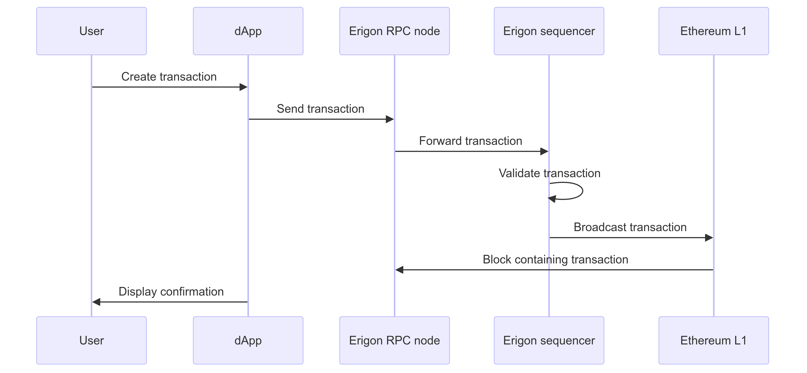

[Erigon](https://github.com/ledgerwatch/erigon), previously known as Turbo-Geth, is a high-performance Ethereum client designed to handle the growing demands of the Ethereum blockchain. It focuses on optimizing performance, disk space, and synchronization speed. 

Erigon has a modular architecture, which makes it highly efficient and customizable for various common blockchain tasks.

## Key features

### Modular architecture
Erigon's modular design allows different components to be developed, optimized, and updated independently. This separation of concerns helps in improving the performance and reliability of each module.

### Performance optimization
Erigon employs advanced techniques for data handling, such as memory-mapped files and optimized data structures, to ensure high-speed processing of blockchain data.

### Reduced disk usage
By implementing a more efficient database schema, Erigon significantly reduces disk usage compared to other Ethereum clients.

### Fast synchronization
Erigon's fast sync method allows nodes to catch up with the blockchain more quickly by downloading only the most recent state of the blockchain, rather than the entire history.

## Erigon as a sequencer

Blockchain sequencers play a critical role in ordering transactions and creating new blocks. Erigon's sequencer processes incoming transactions, organizes them into blocks, and propagates these blocks across the network. 

## RPC node

The remote procedure call (RPC) interface in Erigon allows external applications to interact with the underlying blockchain. This interface is essential for decentralized applications such as dApps, wallets, and other blockchain services. The RPC provides methods for querying blockchain data, sending transactions, and managing accounts.

The following sequence diagram shows how a transaction is processed by the Erigon node.

## CDK erigon 

The CDK implementation of Erigon, available at [0xPolygonHermez/cdk-erigon](https://github.com/0xPolygonHermez/cdk-erigon), is a specialized adaptation that provides a framework for creating and managing zkEVM networks with that run using the zkEVM protocol.

### Differences from the standard erigon

- zkEVM consensus mechanisms: The CDK implementation integrates with zkEVM consensus protocols.

- Optimized for layer 2 solutions: This adaptation is optimized for layer 2 scaling solutions which focus on high throughput and reduced transaction costs.

- Enhanced modular architecture: While Erigon is already modular, the CDK implementation extends this modularity, allowing developers to more easily customize and replace components, such as the consensus mechanism, transaction pool, and state management.

- Integration with the Polygon ecosystem: CDK Erigon is designed to seamlessly integrate with the broader Polygon ecosystem, facilitating interoperability with Polygon products and services, scaling solutions and tools.

- Tailored RPC interface: The RPC interface in the CDK implementation is adapted to support the zkEVM protocol's functionalities and optimizations, enabling more efficient communication and interaction with the network.
