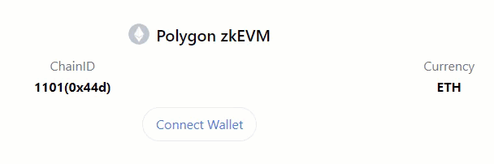

!!!caution
    Check the list of potential risks associated with the use of Polygon zkEVM in the [Disclosures](../get-started/risk-disclosures.md) section.

## Connect to zkEVM mainnet or testnet

Add a full network configuration to your wallet in one click.

Chainlist is a site that provides a button to connect your wallet to the Polygon zkEVM mainnet and the Polygon Cardona zkEVM testnet.

- Go to the [Polygon zkEVM mainnet](https://chainlist.org/chain/1101) page and click **Connect Wallet** to add the Polygon zkEVM mainnet network to your wallet settings.

- Go to the [Polygon zkEVM Cardona testnet](https://chainlist.org/chain/2442) page and click **Connect Wallet** to add the Polygon zkEVM Cardona testnet configurations to your wallet settings.

### Manually add network to wallet

Connect your wallet to the Polygon zkEVM network of your choice by navigating to the add network settings and entering the network details as shown in the table:

| Network | RPC URL | ChainID | Block explorer URL | Currency |
| ------- | ------------------------------- | ---------------- | ---------------- | ----- |
| Polygon zkEVM | `https://zkevm-rpc.com` | `1101` | `https://zkevm.polygonscan.com/` | **ETH** |
| Cardona zkEVM testnet | `https://rpc.cardona.zkevm-rpc.com` | `2442` | `https://cardona-zkevm.polygonscan.com/` | **ETH** |

## Polygon testnet faucet

If you plan on developing a dApp for zkEVM, you may want to deploy your test dapp on the Cardona zkEVM testnet. These test tokens enable you to work with Polygon zkEVM without having to spend actual MATIC tokens on the mainnet zkEVM chain. Visit the [Polygon MATIC faucet page](../../tools/gas/matic-faucet.md) to learn how to get testnet tokens.

## Bridging assets to zkEVM

Once the wallet is connected, the next step is to bridge crypto assets from Ethereum to zkEVM. Use the Polygon Portal to deposit and swap tokens between the Polygon zkEVM chain (or the Cardona zkEVM testnet) and other chains. Visit [the Polygon Portal documentation page](../../tools/wallets/portal.md) for guides on how to connect to and operate the Polygon Portal website.

## Video demo

Here is a video tutorial on how to add Polygon zkEVM testnet to MetaMask and deploy smart contracts:

<video loop width="100%" height="100%" controls="true" >
  <source type="video/mp4" src="../../../img/zkEVM/tutorial.mp4"></source>
  
Your browser does not support the video element.

</video>