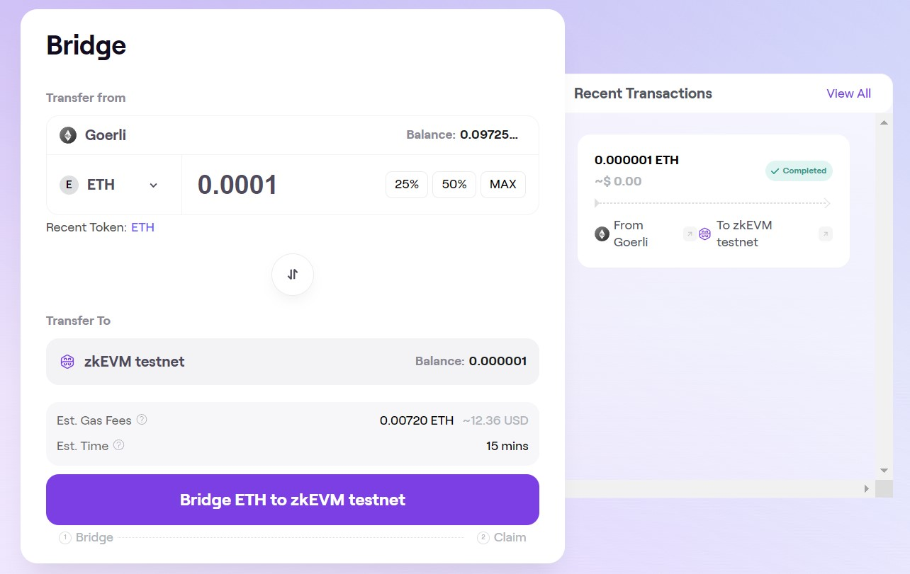
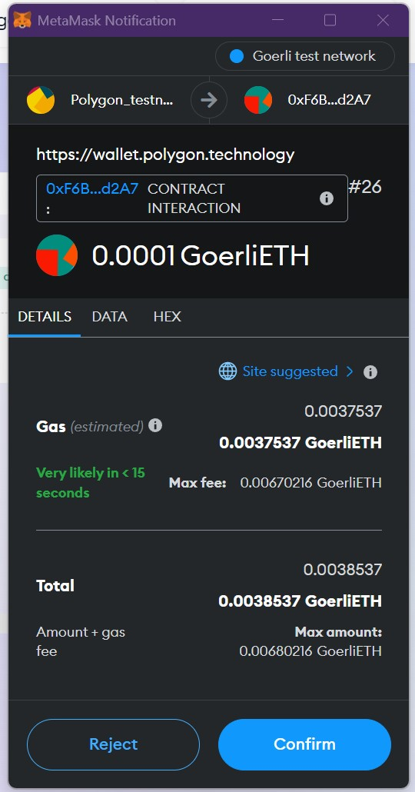
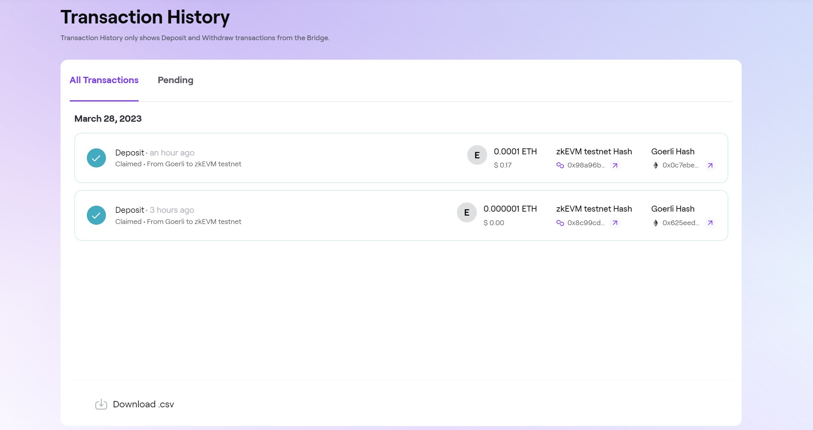

!!!caution
    Check the list of potential risks associated with the use of Polygon zkEVM in the [Disclosures](../../troubleshooting/risk-disclosures.md) section.

Users can deposit assets from Ethereum and transact off-chain on Polygon zkEVM. For moving assets across chains (L1 &harr; zkEVM), you will need to use the zkEVM Bridge. The bridge interface is available for both Mainnet Beta and Testnet in the [Polygon Wallet Suite](https://wallet.polygon.technology/zkEVM/bridge).

The next video is a guide on how to bridge tokens from L1 to the zkEVM Testnet. The same video applies to the zkEVM Mainnet.

<video loop width="100%" height="100%" controls="true" >
  <source type="video/mp4" src="../../../../img/zkEVM/zkevmwallettestnet.mp4"></source>
  
Your browser does not support the video element.

</video>

## Step-by-step guide

Follow this step-by-step guide on how to bridge assets from Ethereum to Polygon zkEVM Mainnet and vice-versa. Or, from an Ethereum testnet to zkEVM testnet, and conversely.

- On the [Polygon Wallet Suite website](https://wallet.polygon.technology/), select the zkEVM tab, which is next to the Proof-of-Stake tab:

- Click on the **Bridge** module to access the zkEVM environment.

- Set the amount of tokens to transfer from Ethereum network to zkEVM Mainnet (Or, from an Ethereum testnet to zkEVM testnet).

- Recent transactions and pending transactions can be viewed on the right hand side of the page.
- Click the **Bridge ETH to zkEVM testnet** button to proceed. This is followed by Metamask's prompt to approve gas to be spent.

- Click **Confirm** to approve the bridge transaction.

- And allow a few moments for your transaction to be processed.

- Once it is completed, past and pending transactions can be viewed by clicking the **Transactions** button located on the left side of the menu.

