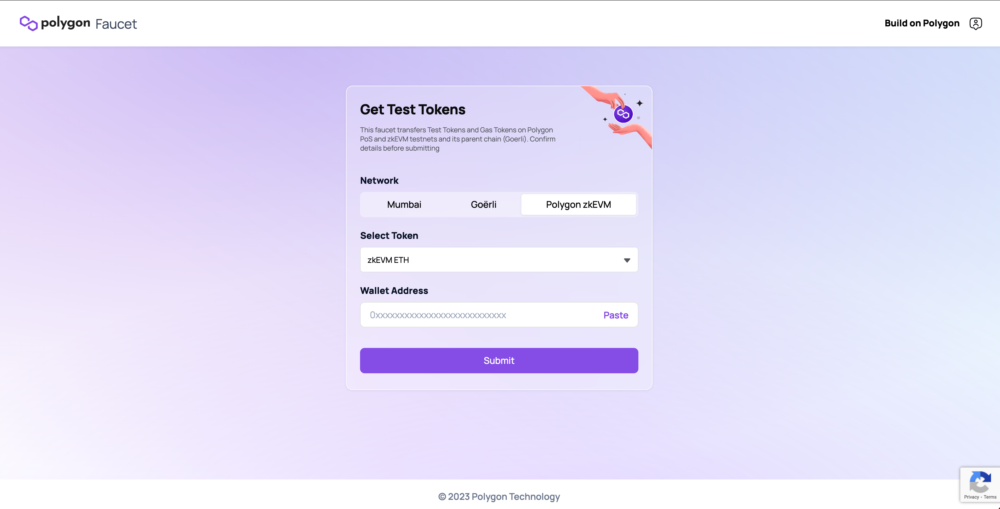
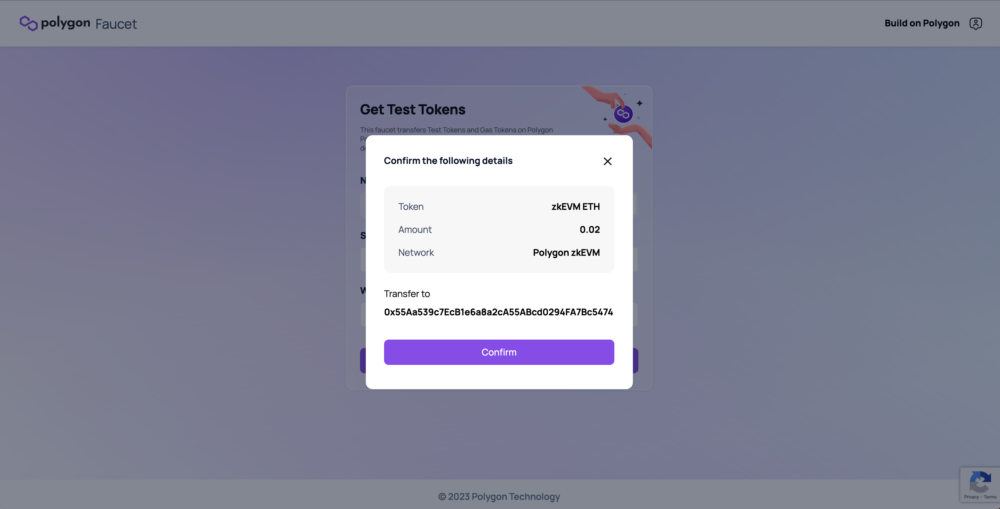
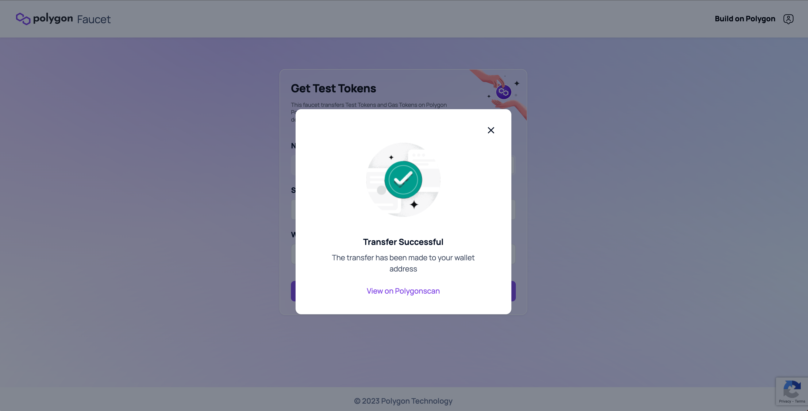

!!!caution
    Check the list of potential risks associated with the use of Polygon zkEVM in the [Disclosures](../../troubleshooting/risk-disclosures.md) section.

Polygon faucet is the official tool provided by Polygon Labs to obtain Testnet tokens. It is a faucet that is similar to what ecosystem partners like Alchemy provide.

The faucet allows anyone to request ETH testnet tokens, such as Sepolia testnet ETH. This cuts out the middle step of bridging testnet tokens from the faucet to the Polygon zkEVM.

!!!info
    Polygon zkEVM network faucet provides 0.02 ETH in a single user request.

    We understand that Goërli ETH holds value which might attract malicious actors. That is why, we have integrated certain security measures in place to prevent any DoS attacks on the Faucet.

Here is how to use the Polygon zkEVM faucet:

- Navigate to [**faucet.polygon.technology**](https://faucet.polygon.technology/)

- Select the network where you want to receive the test tokens. In our case, we will select **Polygon zkEVM**.

- Select the type of Testnet token that you want to receive. In our case, we only have the option to receive **zkEVM ETH** which is also the default option.

- Enter your **wallet address** (you can copy it from your MetaMask or any wallet that supports testnet tokens).

- Click on the **Submit** button to send your token request.

- Click **Confirm** to finalize the transaction.

- After confirmation, you will receive the requested Testnet tokens within ~1 minute. You can also verify the transaction by clicking on the Polygonscan link.

