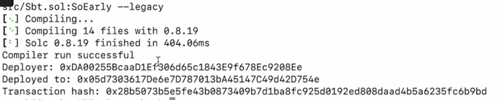

Any smart contract deployable to the Ethereum network can be deployed easily to the Polygon zkEVM network. In this guide, we will demonstrate how to deploy an ERC-721 token contract on the Polygon zkEVM network using Foundry.

We will be following the Soulbound NFT tutorial from [this video](https://www.loom.com/share/41dcd20628774d3bbcce5edf2647312f).

## Set up the environment

Foundry is a smart contract development toolchain. It can be used to manage dependencies, compile a project, run tests and deploy smart contracts. It also lets one interact with the blockchain from the CLI or via Solidity scripts.

### Install Foundry

If you have not installed Foundry, Go to [book.getfoundry](https://book.getfoundry.sh) and select **Installation** from the side menu. Follow the instructions to download **Using Foundryup**.

Next, select **Creating a New Project** from the sidebar. Initialize and give your new project a name: ```forge init zkevm-sbt```

In case of a `library not loaded error`, you should run below command and then repeat the above process again:

```bash
brew install libusb
```

If you never installed Rust or need an update, visit the website [here](https://www.rust-lang.org/tools/install).

### Build a project and test  

Run the command `forge build` to build the project. The output should look something like this:


Now, test the build with `forge test`


You can check out the contents of the newly built project by switching to your IDE. In case of VSCode, just type: ```code .```

## Writing the smart contract

1. Find the [OpenZeppelin Wizard](https://wizard.openzeppelin.com) in your browser, and use the wizard to create an out-of-the-box NFT contract.

    - Select the `ERC721` tab for an NFT smart contract.

    - Name the NFT and give it an appropriate symbol. Example: Name `SoEarly` and Symbol `SOE`.

    - Go ahead and select features for your token. Simply tick the relevant boxes.

    - You can tick the **URI Storage** box if you wish to attach some image or special text to the token.  

2. Open your CLI and install dependencies with this command:

    ```bash
    npm install @openzeppelin/contracts-upgradeable
    ```

3. Remap dependencies to easy-to-read filenames with the command:

    ```bash
    forge remappings > remappings.txt
    ```

4. Inside the new `remapping.txt` file, rename the referencing `openzeppelin-contracts` to `openzeppelin`, which is the name used when importing. That is, change `openzeppelin-contracts/=lib/openzeppelin-contracts` &rarr; `openzeppelin/=lib/openzeppelin-contracts`.

5. Copy the smart contract code in OpenZeppelin: **Copy to Clipboard**

6. In the IDE, open a new `.sol` file, name it and paste the copied code to this file. This is in fact the actual smart contract for the NFT.

## Add control on token transfers

The aim here is to put rules in place stipulating that the token cannot be transferred without burning it.  

- Go to the [OpenZeppelin documentation](https://docs.openzeppelin.com/).

- Look up the signature by searching for `_beforetokentransfererc721`.

- Scroll down to `ERC 721` and copy the corresponding text on the right side:

    ```c
    _beforeTokenTransfer(address from, address to, uint256 firstTokenId, uint256 batchSize) internal
    ```

- Create a new function in the code for the smart contract token called `_beforeTokenTransfer`

    ```c
    function _beforeTokenTransfer (address from, address to, uint256 firstTokenId, uint256 batchSize) internal override {
        require(from==address(0) || to==address(0), "Soulbound: cannot transfer");
        super._beforeTokenTransfer(from, to, firstTokenId, batchSize);
    }
    ```

## Set a token URI (optional)

A token URI is a function that returns the address where the metadata of a specific token is stored. The metadata is a `. json` file where all the data associated with the NFT is stored. Our aim here is to attach some image to the created token.

The stored data typically consists of the name of the token, brief description and URL where the image is stored.

- Choose an image and give it a name relatable to the token

- Find some free of charge IPFS storage for the image, like [NFT.STORAGE](https://nft.storage)

- Upload the image to the storage using your GitHub account

## Add URI json file

This is the file that contains the metadata for the token which includes the image address (i.e., the IPFS address of the image).

- In the IDE, create a new `.json` file which you can call `tokenuri.json`

- Populate the `tokenuri.json` file with the token-name, description and URL where the image is stored:

    ```json
    {
        "title": "So Early",
        "description": "I was super duper early to the Polygon zkEVM",
        "image": "<IPFS address>" /* remove the forward-slash at the end of the URL, if any */
    }
    ```

- Upload the `tokenuri.json` file to the same storage where the image was uploaded

- Copy the address to the `Sbt.sol` inside the `safeMint` function

- Remove the `uri` parameter so as to hardcode it. This makes all tokens to have the same `uri` image, but every consecutively minted pair of tokens will differ by 1 in numerical value of their `tokenId`.

## Populate the `.env` file

In order to deploy on the zkEVM Testnet, populate the `.env` file in the usual way. That is,

- Create a `.env.sample` file within the `src` folder

- Populate `.env.sample` file with your `ACCOUNT_PRIVATE_KEY` and the zkEVM Testnet's `RPC URL` found [here](../get-started/quick-start/connect-wallet.md). So the `.env.sample` file will look like this:

    ```json
    RPC_URL="https://rpc.public.zkevm-test.net"
    PVTKEY="<insert private key here>"
    ```

- Copy the contents of the `.env.sample` file to the `.env` file,

    ```bash
    cp .env.sample .env
    ```

!!!warning

    Make sure `.env` is in the `.gitignore` file to avoid uploading your `ACCOUNT_PRIVATE_KEY`.

## Deploy your contract

1. In the CLI, use the following command to ensure grabbing variables from `.env`:

    ```bash
    source .env
    ```

2. Check if the correct `RPC URL` is read from the `.env` file:

    ```bash
    echo $RPC_URL
    ```

3. You can now use the next command:

    ```bash
    forge create --rpc-url $RPC_URL --private-key $PRIVATE_KEY src/{ContractFile.sol}:{ContractName} --legacy
    ```

    which executes the following:

    - Does a `forge create`.
    - Passes the `RPC_URL` and `PVTKEY`.
    - References the actual smart contract.

    For example, when deploying the `Sbt.sol` contract, the command will look like this:

    ```bash
    forge create --rpc-url $RPC_URL --private-key $PRIVATE_KEY src/Sbt.sol:SoEarly --legacy
    ```

The above command compiles and deploys the contract to the zkEVM Testnet. The output on the CLI looks like this one below.



## Check deployed contract in explorer

- Copy the address of your newly deployed contract (i.e. the `Deployed to:` address as in the above example output).

- Go to the [zkEVM Testnet Explorer](https://testnet-zkevm.polygonscan.com), and paste the address in the `Search by address` field.

- Check `Transaction Details`  reflecting the `From` address, which is the owner's address and the `To` address, which is the same `Deployed to:` address seen in the CLI.
