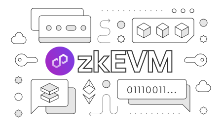

---
hide:
- toc
---

    

    

       <h1 class="hero-heading">Polygon zkEVM</h1>
       
Polygon zkEVM is a Layer 2 network of the Ethereum Virtual Machine (EVM), a zero-knowledge (ZK) rollup scaling solution.

    

     

    

       <a href="./get-started/setup-nodes/local-node">
          

             
zkEVM local node

          

          
Get started by setting up a local zkEVM node.

       </a>
    

    

       <a href="./get-started/deploy-zkevm/">
          

             
Deploy zkEVM

          

          
Get started by deploying zkEVM on Goerli.

       </a>
    

    

       <a href="./spec/evm-differences">
          

             
zkEVM versus EVM

          

          
Discover the key differences between zkEVM and EVM.

       </a>
    

