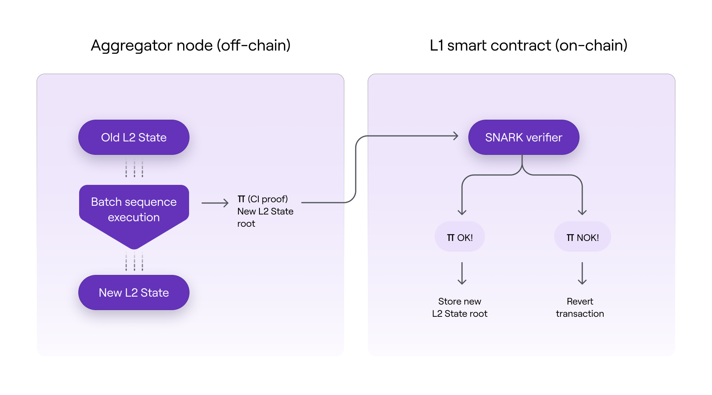

!!!info
    This document is a continuation in the series of articles explaining the [<ins>Transaction Life Cycle</ins>](submit-transaction.md) inside Polygon zkEVM.

The **Trusted Aggregator should eventually aggregate the sequences of batches previously committed by the Trusted Sequencer in order to achieve the L2 State final stage**, which is the Consolidated State.

Aggregating a sequence means successfully adding the resulting L2 State root to the `batchNumToStateRoot` mapping in the L1 'PolygonZkEVM.sol' contract. This is a storage structure that contains all of the consolidated L2 State roots, which are keyed by the last batch index of each aggregated sequence of batches.

```
// BatchNum --> state root
mapping (uint64 => bytes32) public batchNumToStateRoot;
```

Furthermore, the aggregation implies the successful verification of the Zero-Knowledge proof of the computational integrity of the transaction batches execution.

A **SNARK (Succinct Non-interactive Arguments of Knowledge)** is the underlying Zero-Knowledge proof verification schema. One of its key characteristics is the proof's conciseness and speed of verification.

As a result, the integrity of an exhaustive computation can be verified using a fraction of the computational resources required by the original computation. As a result, by employing a SNARK schema, we can provide on-chain security to exhaustive off-chain computations in a gas-efficient manner.



As shown in the above diagram, the off-chain execution of the batches will suppose an L2 state transition and consequently, a change to a new L2 state root.

A **computation integrity (CI) proof of the execution is generated by the Aggregator**, and its on-chain verification ensures validity of that resulting L2 state root.

## Aggregating a Sequence of Batches

In order to aggregate a sequence of batches, the Trusted Aggregator must call the `trustedVerifyBatches` method:

```
function trustedVerifyBatches (
  uint64 pendingStateNum,
  uint64 initNumBatch,
  uint64 finalNewBatch,
  bytes32 newLocalExitRoot,
  bytes32 newStateRoot,
  uint256 [2] calldata proofA,
  uint256 [2][2] calldata proofB,
  uint256 [2] calldata proofC
) public onlyTrustedAggregator
```

​where,

- `pendingStateNum` is the number of state transitions pending to be consolidated, which is set to **0** for as long as the Trusted Aggregator is in operation. The `pendingState` functions as a security measure to be used when L2 state is consolidated by an independent Aggregator.
- `initNumBatch` is the index of the last batch in the last aggregated sequence.
- `finalNewBatch` is the index of the last batch in the sequence being aggregated.
- `newLocalExitRoot` is the root of the Bridge’s L2 Exit Merkle Tree at the end of sequence execution used to compute new Global Exit Root when the sequence is aggregated, and allows bridge claiming transactions to be successfully executed in L1.
- `newStateRoot` is the L2 StateRoot resulting from the execution of the sequence of batches over an older L2 State.
- `proof(A,B and C)` is the Zero-Knowledge proof.

**For a sequence of batches to be successfully aggregated, the following conditions must be met:**

- Aggregation transaction must be sent from the Trusted Aggregator account.
- `initNumBatch` argument must be the index of an already aggregated batch. That is, it must have an L2 State root in `batchNumToStateRoot` mapping.
- `initNumBatch` argument must be less or equal to the last aggregated batch index.
- The sequence to be aggregated must have at least one batch.
- `initNumBatch` and `finalNewBatch` arguments have to be sequenced batches, that is, to be present in the `sequencedBatches` mapping.
- Zero-Knowledge proof of computational integrity must be successfully verified.

The **Executor and the Prover are services of the Aggregator node that execute batches and generate Zero-Knowledge proofs**. We will herein treat them as Ethereum Virtual Machine **black box** interpreters that can:

- execute a sequence of transaction batches on the current L2 state,
- calculate the resulting L2 state root, and
- generate a Zero-Knowledge proof of computational integrity for the execution.

The proving/verification system is designed in such a way that successful proof verification equates to cryptographically proving that executing the given sequence of batches over a Specific L2 State results in an L2 State represented by the `newStateRoot` argument.

The following code snippet is a part of the [`PolygonZkEVM.sol`](https://github.com/0xPolygonHermez/zkevm-contracts/blob/main/contracts/PolygonZkEVM.sol) contract, which shows the Zero-Knowledge proof verification:

```
// Get snark bytes
bytes memory snarkHashBytes = getInputSnarkBytes (
  initNumBatch,
  finalNewBatch,
  newLocalExitRoot,
  oldStateRoot,
  newStateRoot
);

// Calculate the snark input
uint256 inputSnark = uint256(sha256(snarkHashBytes)) % _RFIELD;

// Verify proof
require (
  rollupVerifier.verifyProof(proofA, proofB, proofC, [inputSnark]),
  "PolygonZkEVM :: _verifyBatches : Invalid proof"
);
```

### rollupVerifier

`rollupVerifier` is an external contract that has a function `verifyProof` that takes a proof (`proofA`, `proofB`, `proofC`) and a value `inputSnark` and returns a boolean value that will be `true` if the proof is valid and `false` if it isn’t.

The successful verification of the proof just confirms the integrity of the computation, but not that the correct inputs were used and that they resulted in the correct output values. Public arguments are used to publicly disclose key points of the computation being proved, in order to prove that it was performed using the correct inputs and reveal the outputs.

This way, during the proof verification, the L1 smart contract will set the public arguments to ensure that the state transition being proved corresponds to the execution of the batches committed by the Trusted Sequencer.

### inputSnark

`inputSnark` is a 256-bits unique cryptographic representative of a specific L2 State transition, which is used as public argument. It is computed as `sha256 mod % _RFIELD` hash of a bytes string called `snarkHashBytes` (modulo operator is needed due to math primitives used in SNARKs).

`snarkHashBytes` array is computed by a smart contract’s function called `getInputSnarkBytes` and it is an ABI-encoded packed string of the following values:

- **msg.sender**: Address of Trusted Aggregator.
- **oldStateRoot**: L2 State Root that represents the L2 State before the state transition
that wants to be proven.
- **oldAccInputHash**: Accumulated hash of the last batch aggregated.
- **initNumBatch**: Index of the last batch aggregated.
- **chainID**: Unique chain identifier.
- **newStateRoot**: L2 State Root that represents the L2 State after the state transition
that is being proved.
- **newAccInputHash**: Accumulated hash of the last batch in the sequence that is
being aggregated.
- **newLocalExitRoot**: Root of the Bridge’s L2 Exit Merkle Tree at the end of
sequence execution.
- **finalNewBatch**: Number of the final batch in the execution range.

`inputSnark` will represent all the L2 transactions of a specific L2 State transition, executed in a specific order, in a specific L2 (`chainID`), and proved by a specific Trusted Aggregator (`msg.sender`). The `trustedVerifyBatches` function not only verifies the validity of the zero-knowledge proof, but it also checks that the value of `inputSnark` corresponds to an L2 State transition that is pending to be aggregated.

If the internal call to `_verifyAndRewardBatches` returns `true`, it will mean that the sequence of batches is verified successfully, and then the `newStateRoot` argument will be added to the `batchNumToStateRoot` mapping. The index of the last batch in the sequence will be used as the key for the entry.

Finally a `TrustedVerifyBatches` event will be emitted.

```
event TrustedVerifyBatches (
  uint64 indexed numBatch,
  bytes32 stateRoot,
  address indexed aggregator
);
```

Once the batches have been successfully aggregated in L1, all zkEVM nodes can validate their local L2 state by retrieving and validating consolidated roots directly from the L1 Consensus Contract (`PolygonZkEVM.sol`). As a result, the L2 consolidated State has been reached.
