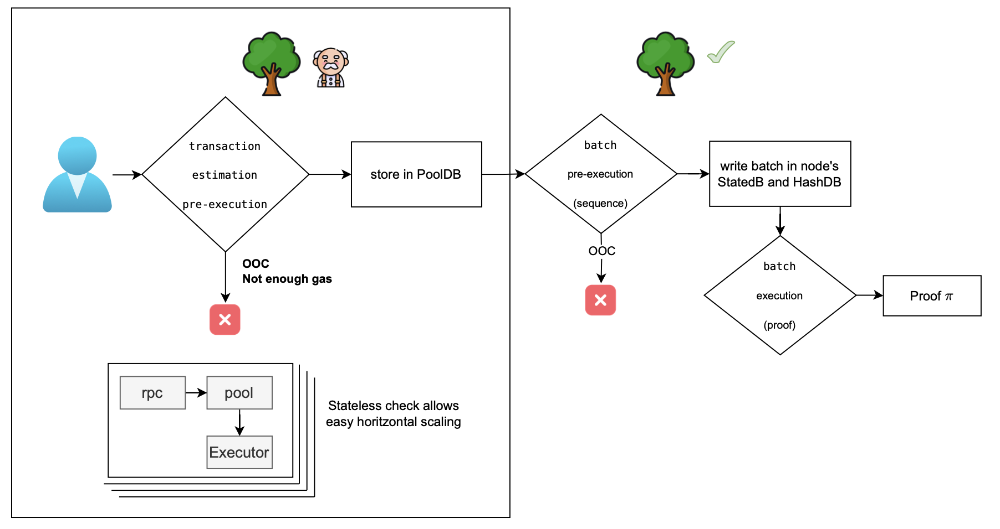
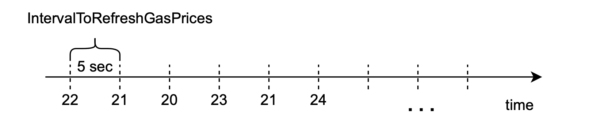
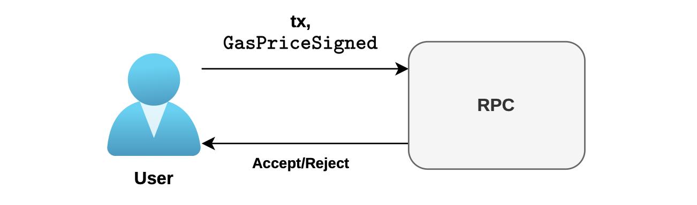
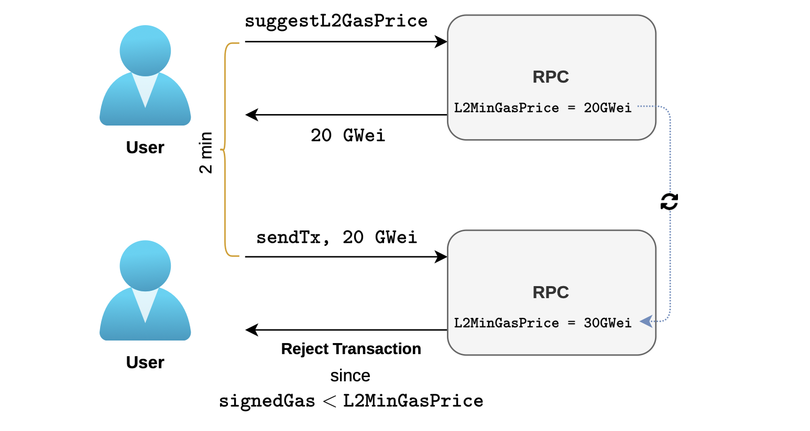
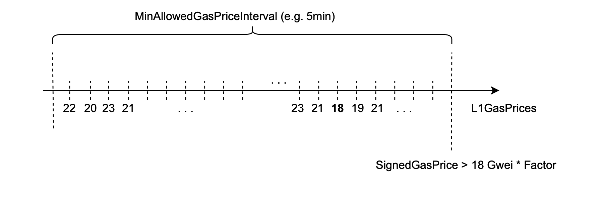
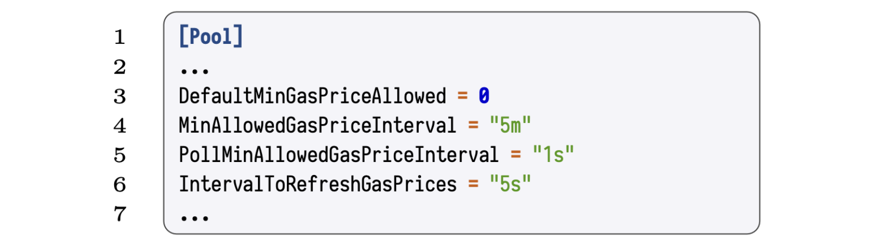
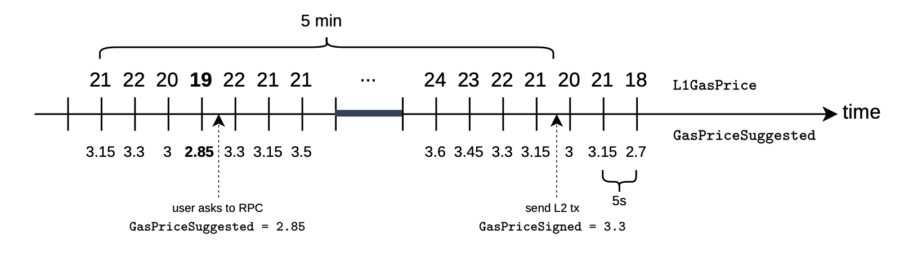

## Gas price suggester

Let's take a quick view of the initial phase of the process, which involves the RPC component of zkEVM.

Pre-execution of a transaction involves the following stages:

- Estimation of the $\texttt{gasPrice}$, adding it to a transaction, and submitting the transaction to L2.
- Checking user's signed $\texttt{gasPrice}$ against the expected $\texttt{L2GasPrice}$, then either discarding or storing the transaction in the Pool.
- Sequencer forms batches with transactions from the pool, preparing batches for execution.

See the the picture below for an overview of the pre-execution process.

### Time-related variations

So, how can the fact that the L1 $\texttt{gasPrice}$ varies with time be taken into account?

In order to obtain L1 gas prices, we can poll for it every 5 seconds. As shown in the timeline below, gas prices vary with time.

### Naïve approach

Let's look at this in two parts; gasPrice suggestion, and transaction sending.

In the first step, the user asks via an RPC call for a suggested gas price to sign with. The suggested price $\texttt{L2GasPrice}$ is computed as:

$$
\texttt{L2GasPrice} = \texttt{L1GasPrice} \cdot \texttt{L1GasPriceFactor}
$$

to sign a transaction with.

After receiving the suggested gas price, the user sends the desired L2 transaction with gas price of their choice. Call it **signed gas price**, denoted by $\texttt{SignedGasPrice}$.

Observe that the user's chosen gas price can be equal to, greater than, or lower than the suggested price, each resulting in one of the two scenarios: either the transaction is accepted or it is rejected. See the below figure.

If $\texttt{SignedGasPrice}$ provided by the user is less than the current $\texttt{L2GasPrice}$, the transaction is automatically rejected[^a] and not included into the pool (error $\texttt{ErrGasPrice}$).

### Decision interval approach

However, this previous scenario does not offer good UX.

There is an unbounded interval of time between when the user requests for a suggested $\texttt{gasPrice}$ and when a transaction with the signed gas price can be sent to L2.

During the time when the user receives the suggested $\texttt{gasPrice}$, includes it in the transaction, and finally submits the transaction to L2, the actual $\texttt{L2GasPrice}$ could have increased substantially.

As depicted in the figure below, the $\texttt{L2GasPrice}$ could be refreshed in the interim, causing the transaction to be rejected.

The above scenario is undesirable. And thus needs to be remedied.

One solution to the above situation is to, instead of comparing the user's $\texttt{SignedGasPrice}$ with the current $\texttt{L2GasPrice}$, rather compare it with the minimum $\texttt{L2GasPrice}$ among the suggested gas prices in the given time interval.

That is, allow transactions from users that have signed any $\texttt{SignedGasPrice}$ above the minimum L2 gas price recorded during a given time interval. 

Call it the $\texttt{MinAllowedPriceInterval}$. And denote the minimum L2 gas price by $\texttt{L2MinGasPrice}$.

So then, given the $\texttt{MinAllowedPriceInterval}$, transaction are rejected only if the $\texttt{SignedGasPrice}$ does not exceed $\texttt{L2MinGasPrice}$. That is, checking the following condition:

$$
\texttt{SignedGasPrice} > \texttt{L2MinGasPrice}
$$

**Example** 

The figure below shows the case where $\texttt{MinAllowedPriceInterval} = 5 \texttt{ minutes}$ and the lowest among suggested L2 gas prices is $18$. i.e., $\texttt{L2GasPrice} = 18$. 

So, if the user signed with $\texttt{SignedGasPrice} = 18$, then the transaction gets rejected because it will not cover costs as it is not above the $\texttt{L2MinGasPrice}$.

Whereas, if the user signs with only $\texttt{SignedGasPrice} = 19$, then the transaction would be accepted.

These parameters can be configured in the Polygon zkEVM node:

- $\texttt{DefaultMinGasPriceAllowed}$ which is the default minimum gas price to suggest.
- $\texttt{MinAllowedGasPriceInterval}$, as explained above, is the interval within which to find the lowest suggested gas price and compare it with the user's gas price in the transaction.
- $\texttt{PollMinAllowedGasPriceInterval}$ is the interval to poll L1 in order to find the suggested L2 minimum gas price.
- $\texttt{IntervalToRefreshGasPrices}$ is the interval to refresh L2 gas prices.

More specifically, these are configured in the $\texttt{[Pool]}$ section of the configuration file found [here](https://github.com/0xPolygonHermez/zkevm-node/blob/b938572f138ba6cc40ef6736153c469afeb11c96/config/default.go#L37).

### Final approach

However, in the previous design, the zkEVM endpoint responsible for offering a gas price suggestion to the user, known as the **L2 Gas Price Suggester**, faces a significant problem design.

The price of posting transactional data to L1 is charged to the zkEVM network at a **full L1 price**.

Therefore, if we propose a gas price using $\texttt{L1GasPriceFactor}$, representing the measure of computational reduction in L2, there is a risk of running out of Wei reserves for posting data to L1.

**Solution**

In order to solve the previous situation, we will recommend a slightly higher percentage of the gas price to the user, employing a $\texttt{SuggesterFactor of 0.15 ≈ 4 · L1GasPriceFactor}$ such that:

$$
\texttt{GasPriceSuggested = L1GasPrice · SuggestedFactor}
$$

### Numerical example: L2MinGasPrice

In the figure below, we observe that when the user queries the suggested gas price through the RPC, the network responds with the current suggested gas price computed as:

$$
0.15 · 19 = 2.85
$$

where $19$ is the current L1 gas price, updated every $5$ seconds.

We observe that, with the naïve approach, the user should have signed with a gas price that's higher than

$$
0.15 \cdot 21 = 3.15
$$

because the L1 gas price at the moment of sending the transaction is $21$.

However, using the final approach, at the time of sending the transaction, the RPC will accept the transaction as long as $\texttt{SignedGasPrice}$ is higher than the minimum suggested gas price from the $5$ minutes interval (as shown in the figure), which in this instance is:

$$
19·0.15 = 2.85
$$

In order to get his transaction accepted, the user must set the gas price of the transaction to:

$$
\texttt{SignedGasPrice} = 3.3 > 2.85 = \texttt{L2MinGasPrice} 
$$

The user has signed with gas price that is higher than the suggested gas price to ensure that the transaction is executed and maybe get prioritizes among other transactions.

[^a]: Recall that a transaction can be rejected due to other checks explained before.
