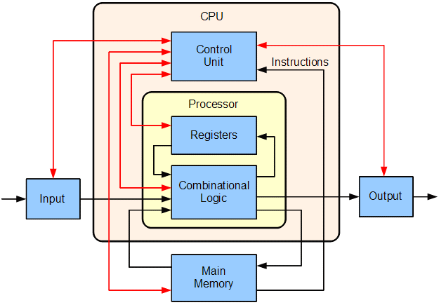
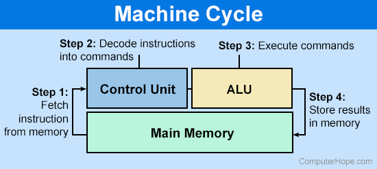
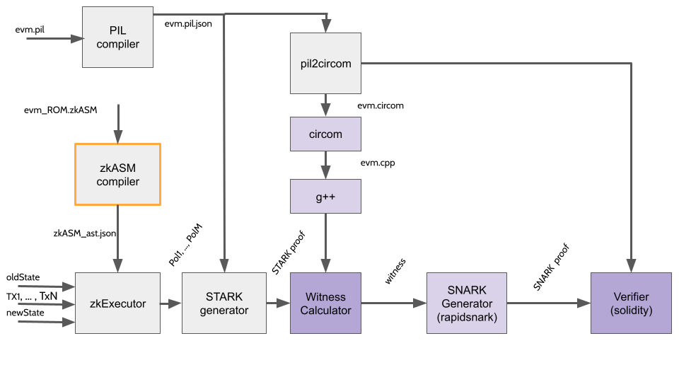

Ethereum is a state machine that transitions from an old state to a new state by reading a series of transactions. It is a natural choice, in order to interpret the set of EVM opcodes, to design another state machine as for the interpreter.

One should think of it as building a state machine inside another state machine, or more concretely, building an Ethereum inside the Ethereum itself. The distinction here is that the former contains a virtual machine, the zkEVM, that is zero-knowledge friendly.

## zkEVM as a microprocessor

Following the previous discussion, it is good to see the outer state machine as a microprocessor. What we have done is creating a microprocessor, composed by a series of assembly instructions and its associate program (i.e., the ROM) running on top of it, that interprets the EVM opcodes.

Below provided is the block diagram of a basic uniprocessor-CPU computer. Black lines indicate data flow, whereas red lines indicate control flow; arrows indicate flow directions.

As in input, the microprocessor will take the transactions that we want to process and the old state. After fetching the input, the ROM is used to interpret the transactions and generate a new state (the output) from them. Check out the diagram below for a better visualization.

## The role of zkASM

The zero-knowledge Assembly (zkASM) is the language used to describe, in a more abstract way, the ROM of our processor. Specifically, this ROM will tell the Executor how to interpret the distinct types of transactions that it could possibly receive as an input.

From this point, the Executor will be capable of generating a set of polynomials that will describe the state transition and will be later on used by the STARK generator to generate a proof of correctness of this state transition.

