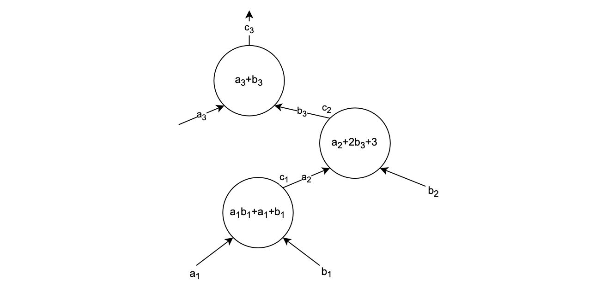

This document describes how PLONK verification is implemented in Polynomial Identity Language.

This document will help us in understanding how to implement $\mathcal{PlonK}$ verification by using **connection arguments**. Let's begin!

## PLONK-like circuit

Suppose one is given a $\mathcal{PlonK}$-like circuit $C$. Such a circuit is defined as a set of preprocessed polynomials $\texttt{QL}$, $\texttt{QR}$, $\texttt{QM}$, $\texttt{QO}$ and $\texttt{QC}$ describing all the $\mathcal{PlonK}$ gates (that is, interpolating the values of the PlonK selectors at each of the gates in a selected order), as well as connection polynomials; $\texttt{SA}$, $\texttt{SB}$ and $\texttt{SC}$; specifying the copy-constraints that need to be satisfied.

The polynomials; $\texttt{SA}$, $\texttt{SB}$ and $\texttt{SC}$; are constructed as before. We provide a concrete but small example of what the circuit-to-trace translation looks like.

Below figure depicts a $\mathcal{PlonK}$ circuit.



### Observations

- All values in the below execution trace, depend only on the shape of the circuit itself. So, if the circuit does not change, the corresponding polynomial should not be recomputed.

- The polynomials; $\texttt{SA}$, $\texttt{SB}$ and $\texttt{SC}$; are constructed so as to enable verification of the copy-constraints; $c_2 = b_3$ and $c_1 = a_2$; as shown in the circuit.

- As explained before, in the construction of the connection $S$ polynomials, values in cells of the same colour are swapped.

Belo figure shows the execution trace raised by the circuit.


### PIL code

The PIL code that validates this circuit is as follows:

```
include "config.pil"; 

namespace Plonk(%N);
pol constant QL, QR, QM, QO, QC; 
pol constant SA, SB, SC;
pol constant L1;

pol commit a, b, c; 

public pi = a(0);

// Public values check
L1 * (a - :pi) = 0;

// Plonk equation
pol ab = a*b;
QL*a + QR*b + QM*ab + QO*c + QC = 0;

// Copy-constraints check
{a, b, c} connect {SA, SB, SC};
```
