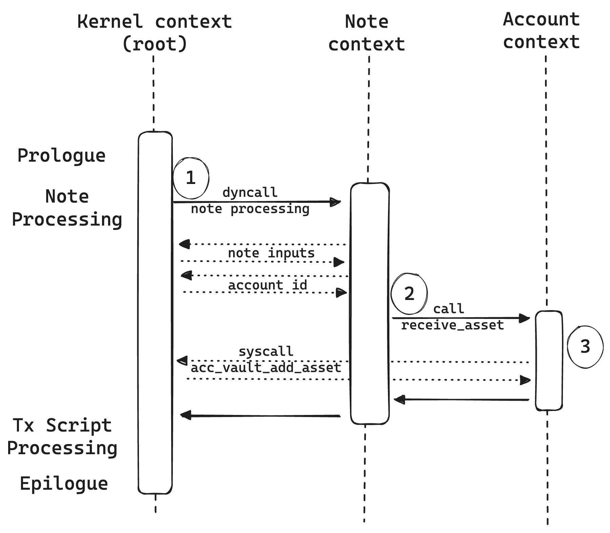

Miden assembly program execution can span multiple isolated contexts. An execution context defines its own memory space which is not accessible from other execution contexts. Note scripts cannot directly write into account data. This should be possible if only if the account exposes respective functions.

The kernel program always starts executing in a root context. Thus, the prologue sets the memory for the root context. To move execution into a different context, we can invoke a procedure using the `call` or `dyncall` instruction. In fact, any time we invoke a procedure using the `call` instruction, the procedure is executed in a new context.

While executing in a note, account, or tx script context, we can request to execute some procedures in the kernel context, which is where all necessary information was stored during the prologue. Switching to the kernle context can be done via the `syscall` instruction. The set of procedures which can be invoked via the `syscall` instruction is limited by the [transaction kernel API](https://github.com/0xPolygonMiden/miden-base/blob/main/miden-lib/asm/kernels/transaction/api.masm). Once the procedure call via `syscall` returns, the execution moves back to the note, account, or tx script from which it was invoked.

<center>

</center>

The above diagram shows different context switches in a simple transaction. In this example, an account consumes a [P2ID](https://github.com/0xPolygonMiden/miden-base/blob/main/miden-lib/asm/note_scripts/P2ID.masm) note and receives the asset into its vault. As with in any MASM program, the transaction kernel program starts in the root context. It executes the Prologue and stores all necessary information into the root memory.

The next step, note processing, starts with a `dyncall` and in doing so, invoking the note script. This command moves execution into a different context **(1)**. In this new context, the note has no access to the kernel memory. After a successful ID check, which changes back to the kernel context twice to get the note inputs and the account id, the script executes the `add_note_assets_to_account` procedure.

```arduino
# Pay-to-ID script: adds all assets from the note to the account, assuming ID of the account
# matches target account ID specified by the note inputs.
# ...
begin

    ... <check correct ID>

    exec.add_note_assets_to_account
    # => [...]
end
```

The procedure cannot simply add assets to the account, because it is executed in a note context. Therefore, it needs to `call` the account interface. And in doing so, it moves execution into a second context - Account context - isolated from the note context **(2)**.

```arduino
#! Helper procedure to add all assets of a note to an account.
#! ...
proc.add_note_assets_to_account
    ...

    while.true
        ...

        # load the asset and add it to the account
        mem_loadw call.wallet::receive_asset
        # => [ASSET, ptr, end_ptr, ...]
        ...
    end
    ...
end
```

The [wallet](https://github.com/0xPolygonMiden/miden-base/blob/main/miden-lib/asm/miden/contracts/wallets/basic.masm) smart contract provides an interface for accounts to recieve and send assets. In this new context, the wallet calls the `add_asset` procedure of the account API.

```arduino
export.receive_asset
    exec.account::add_asset
    ...
end
```

The [account API](https://github.com/0xPolygonMiden/miden-base/blob/main/miden-lib/asm/miden/account.masm#L162) exposes procedures to manage accounts. This particular procedure that was called by the wallet invokes a `syscall` to return back to the root context **(3)**, where the account vault is stored in memory (see Prologue). `syscall` can incoke all procedures defined in the [Kernel API](https://github.com/0xPolygonMiden/miden-base/blob/main/miden-lib/asm/kernels/transaction/api.masm).

```arduino
#! Add the specified asset to the vault.
#! ...
export.add_asset
    syscall.account_vault_add_asset
end
```

Now, the asset can be safely added to the vault within the kernel context and the note successfully be processed.