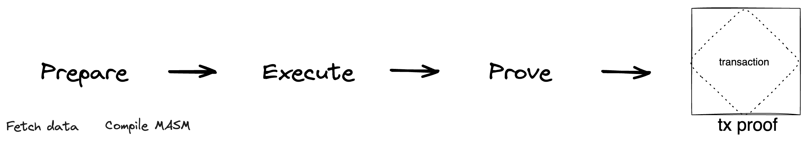

# Transaction Execution
Transactions are being executed by the Miden Transaction Executor. Transaction execution results in a `ExecutedTransaction` object and consists of the following steps:

1. Fetch the data required to execute a transaction from the data store.
2. Compile the transaction into an executable [MASM](https://0xpolygonmiden.github.io/miden-vm/user_docs/assembly/main.html) program using the transaction compiler.
3. Execute the transaction program and create an `ExecutedTransaction` object.
4. Prove the `ExecutedTransaction` using the Transaction Prover.

One of the main reasons for splitting execution and proving is that it allows to have "stateless provers" - i.e., the executed transaction contains all data needed to re-execute and prove a transaction (no database access is needed). This is very powerful and allows the distribution of proof generation much more easily.

## The Data Store and Transaction Inputs
The data store defines the interface that transaction objects use to fetch data required for transaction execution. It stores account, chain, and input note data required to execute a transaction against the account with the specified ID.

Specifically, it must provide the following inputs to the transaction

- the `Account` including the [AccountID](https://0xpolygonmiden.github.io/miden-base/architecture/accounts.html#account-id) and the [AccountCode](https://0xpolygonmiden.github.io/miden-base/architecture/accounts.html#code) which will be executed during the transaction.
- the `BlockHeader`, which contains metadata about the block, commitments to the current state of the chain and the hash of the proof that attests to the integrity of the chain.
- the `ChainMmr`, which allows for efficient authentication of consumed notes during transaction execution. Authentication is achieved by providing an inclusion proof for the consumed notes in the transaction against the `ChainMmr`-root associated with the latest block known at the time of transaction execution.
- the `InputNotes` that are being consumed in the transaction (InputNotes), including the corresponding note data, e.g. the [note script](https://0xpolygonmiden.github.io/miden-base/architecture/notes.html#script) and [serial number](https://0xpolygonmiden.github.io/miden-base/architecture/notes.html#serial-number).

_Note: The `InputNotes` must all be already recorded on-chain in order for the transaction to succeed. And there is no Nullifier-check during a transaction. Nullifiers are being checked by the Miden Operator during transaction verification. So at the transaction level, there is "double spending"._

## The Transaction Compiler
Every transaction must be executed within the Miden VM to generate a transaction proof. In Miden there is a proof for every transaction. The transaction compiler is responsible for building executable programs. The generated programs - MASM programs - can then be executed on the Miden VM which generates a zkProof. In addition to transaction compilation, the transaction compiler provides methods which can be used to compile Miden account code, note scripts, and transaction scripts.

Compilation results in an executable MASM Program, including the provided account interface and notes, an optional transaction script and the [Transaction Kernel Program](kernel.md). The Transaction Kernel Program defines procedures and the memory layout for all parts of the transaction. A detailed description can be found in the next section.

Finally, after the transaction program has been compiled and the inputs including the advice provider were correctly populated, the transaction can be executed.

## The Executed Transaction and the Transaction Outputs
The `ExecutedTransaction` object represents the result of a transaction - not its proof yet. From it, the account, and storage delta can be extracted. Furthermore, it serves as an input of the transaction prover to generate the proof. A successfully executed transaction results in a new state of the provided account, a vector of all created Notes (`OutputNotes`) and a vector of all the consumed Notes (`InputNotes`) together with their Nullifiers.

## The Transaction Prover
The Transaction Prover proves the provided `ExecutedTransaction` and returns a `ProvenTransaction` object. This object can be verified by the Miden Node using the Transaction Verifier and if valid updating the [State](../../architecture/state.md) databases.
