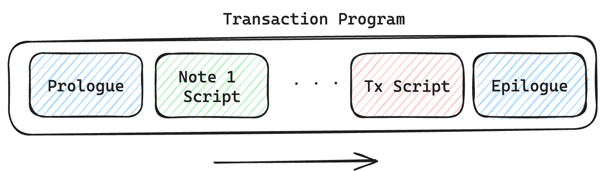
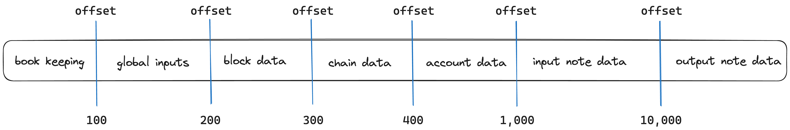

The transaction kernel program is responsible to execute a Miden rollup transaction within the Miden VM. Therefore, it is written in [MASM](https://0xpolygonmiden.github.io/miden-vm/user_docs/assembly/main.html) and it is defined as MASM [kernel](https://0xpolygonmiden.github.io/miden-vm/user_docs/assembly/execution_contexts.html#kernels). The kernel provides context-sensitive security preventing unwanted read and write access. It defines a set of procedures which can be invoked from other [contexts](https://0xpolygonmiden.github.io/miden-vm/user_docs/assembly/execution_contexts.html#execution-contexts) - e.g., notes - to be executed in the root context.

In general, the kernel's procedures must reflect everything users might want to do in executing transactions, from transferring assets to complex smart contract interactions with custom code. Learn more about available procedures and contexts [here](procedures.md).

The kernel has a well-defined structure which must do the following:

1. **Prologue**: prepares the transaction for processing by parsing the transaction data and setting up the root context.
2. **Note Processing**: executes the note processing loop which consumes each InputNote and invokes the note script of each note.
3. **Transaction Script Processing**: executes the optional transaction script.
4. **Epilogue**: finalizes the transaction by computing the created notes commitment, the final account hash, asserting asset invariant conditions and asserting the nonce rules are upheld.

<center>

</center>

## The Inputs
The transaction kernel program receives two type of inputs, public inputs via the `operand_stack` and secret inputs via the `advice_provider`. The stack holds the global inputs. They serve as a commitment to the data being provided via the advice provider. The advice stack holds data of the last known block, account and input note data. The details are layed out in the next paragraph.

## The Prologue
The transaction prologue is executed at the beginning of a transaction. It needs to accomplish the following tasks:

1. "Unhash" the inputs and lay them out in root context's memory.
2. Build a single vault ("tx vault") containing assets of all inputs (input notes and initial account state).
3. Verify that all input notes are present in the Note DB.

In other words, the prologue stores all provided information from the inputs and the advice provider into the appropriate memory slots. It then reads the data for account and notes from the advice provider, writes it to memory, hashes it, and verifies that the resulting hash matches the commitments provided via the stack. Finally, it creates a single vault for the assets that are involved.

The memory layout looks as follows. The kernel context has access to all of those memory slots.

<center>

</center>

The book keeping section is needed to keep track of variables which are used internally by the transaction kernel.

First, all **global inputs** are being stored in the pre-defined memory slots. Global inputs are being provided via the `operand_stack` to the VM at transaction execution. The include the block hash, the account ID, the initial account hash, and the Nullifier commitment. This is a sequential hash of all `(nullifier, ZERO)` pairs for the notes consumed in the transaction.

Second, the **block data** is being processed. This involves reading the block data from the advice provider and storing it at the appropriate memory addresses. Block data is provided from the latest known block and consists of note, state and batch root, the block;s the previous hash and proof hash, as well as the block number. As the data is read from the advice provider, the block hash is computed. It is asserted that the computed block hash matches the block hash stored in the global inputs.

Third, the **chain data** is being processed in a similar way as the block data. In this case the chain root is being recomputed and compared against the chain root stored in the block data section.

Fourth, the **account data** is being processed. This involves reading the data from the advice provider and storing it at the appropriate memory addresses. The account data consists of roots of the account's vault, its storage and code. As the account data is read from the advice provider, the account hash is computed. If the account is new then the global initial account hash is updated and the new account is validated.  If the account already exists then it is asserted that the computed account hash matches the account hash provided via global inputs. It is also asserted that the account id matches the account id provided via the global inputs (`operand_stack`).

Fifth, the **input notes** are being processed. This involves per note reading the data from the advice provider and storing it at the appropriate memory addresses. Next to the total number of consumed notes, input note data consists of its serial number, the roots of the script, inputs and asset vault, its metadata and all its assets. As each note is consumed its hash and nullifier is computed. The transaction Nullifier commitment is computed via a sequential hash of all `(nullifier, ZERO)` pairs for all consumed notes. This step involves authentication that the input note data provided via the advice provider is consistent with the chain history.

_Note: One needs to provide the note data to compute the Nullifier, e.g. the [note script](https://0xpolygonmiden.github.io/miden-base/architecture/notes.html#script) and the [serial number](https://0xpolygonmiden.github.io/miden-base/architecture/notes.html#serial-number). So one needs to know the note data to execute the prologue of a transaction. This is how the [note recipient](https://0xpolygonmiden.github.io/miden-base/architecture/notes.html#note-recipient) defines the set of users who can consume a specific note. The executing account needs to provide the pre-image data to the recipient at the time of execution._

Lastly, if a transaction script is provided, its root is being stored at the pre-defined memory address.

## The Note Processing
If there are input notes they are being consumed in a loop. For every note, the [MAST root](https://0xpolygonmiden.github.io/miden-vm/design/programs.html) of the note script is being loaded onto the stack. Then, by calling a [`dyncall`](https://0xpolygonmiden.github.io/miden-vm/user_docs/assembly/code_organization.html?highlight=dyncall#dynamic-procedure-invocation) the note script is being executed in a new context to prevent unwanted memory access.

```arduino
    # loop while we have notes to consume
    while.true
        # execute the note setup script
        exec.note::prepare_note
        # => [NOTE_SCRIPT_HASH]

        # invoke the note script using the dyncall instruction
        dyncall
        # => [OUTPUT_3, OUTPUT_2, OUTPUT_1, OUTPUT_0]

        # clean up note script outputs
        dropw dropw dropw dropw
        # => []

        # check if we have more notes to consume and should loop again
        exec.note::increment_current_consumed_note_ptr
        loc_load.0
        neq
        # => [should_loop]
    end
```

In processing a note, the creation of a new note might be triggered. If so, all necessary information about the new note is being stored in the *output note data* in memory.

_Note: The Miden Transaction Kernel Program prevents notes from having direct access to account storage. Notes can only call the account interface to trigger write operations in the account._

## The Transaction Script Processing
If there is a transaction script provided with the transaction, it will be processed after all notes are being consumed. By loading the transaction script root onto the stack the kernel can invoke a `dyncall` and in doing so execute the script. The transaction script is again being executed in its own context.

The transaction script can be used to authenticate the transaction by increasing the account's nonce and signing the transaction, see the following example:

```arduino
    use.miden::contracts::auth::basic->auth_tx

    begin
        call.auth_tx::auth_tx_rpo_falcon512
    end
```

_Note: The executing account must expose the `auth_tx_rpo_falcon512` function in order for the transaction script to call it._


## The Epilogue
The Epilogue finalizes the transaction. It

1. computes the final account hash
2. if the account has changed, assert that the final account nonce is greater than the initial
  account nonce
3. computes the created notes commitment
4. asserts that the input and output vault roots are equal

There is an exception for special accounts, called faucets, which can mint or burn assets. In that case input and output vault roots are not equal.

## The Outputs
The transaction kernel program outputs the transaction script root, a commitment of all newly created outputs notes, and the account hash in its new state.
