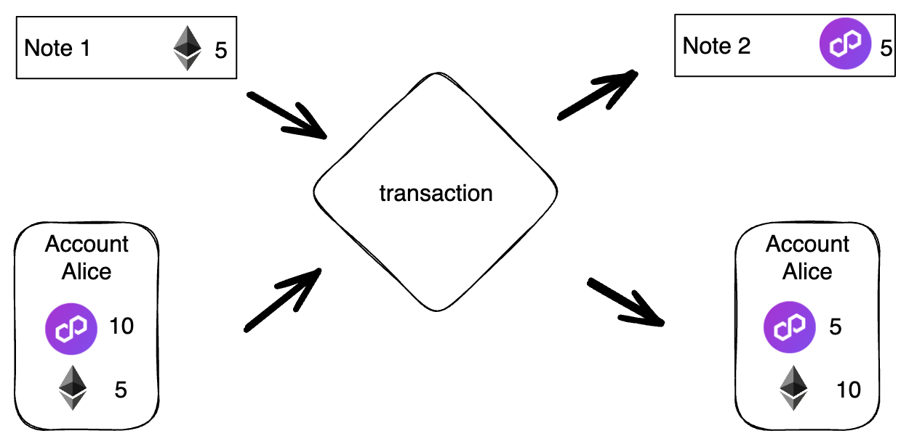

# Transactions overview

Transactions in Miden can be understood as facilitating account state changes. Asset transfers between accounts are done by executing transactions. They take a single account and some [notes](../notes.md) as input and output the same account at a new state together with some other notes.

Miden aims for parallel and private transaction execution. Because a transaction is always performed against a single account, Miden obtains asynchronicity. And, because every transaction causes a provable state-change with a STARK proof, it provides privacy when executed locally.

## Transaction design
Transactions describe the state-transition of a single account that takes chain data and `0 to 1023` notes as input and produces a `TransactionWitness` and `0 to 4096` notes as output.

{ width="75%" }

At its core, a transaction is an executable program - the transaction kernel program - that processes the provided inputs and creates the requested outputs. Because the program is executed by the Miden VM, a STARK-proof is generated for every transaction.

The next sections explain the details of a Miden transaction.

* Transaction [execution](execution.md)
* Transaction [kernel](kernel.md)
* Transaction [procedures](procedures.md)
* Transaction [modes](modes.md)

## Asset transfer using two transactions
Transferring assets between accounts requires two transactions as shown in the diagram below.

The first transaction invokes a function on `account_a` (e.g., "send_asset" function) which creates a new note and also updates the internal state of `account_a`. The second transaction consumes the note which invokes a function on `account_b` (e.g., "receive_asset" function), which also updates the internal state of `account_b`.

It is important to note that both transactions can be executed asynchronously: first `transaction1` is executed, and then, some time later, `transaction2` can be executed. This opens up a few interesting possibilities:

* Owner of `account_b` may wait until they receive many notes and process them all in a single transaction.
* A note script may include a clause which allows the source account to consume the note after some time. Thus, if `account_b` does not consume the note after the specified time, the funds can be returned. This mechanism could be used to make sure funds sent to non-existent accounts are not lost.
* Neither sender nor the recipient need to know who the other side is. From the sender's perspective they just need to create `note1` (and for this they need to know the assets to be transferred and the root of the note's script). They don't need any information on who will eventually consume the note. From the recipient's perspective, they just need to consume `note1`. They don't need to know who created it.
* Both transactions can be executed "locally". For example, we could generate a zk-proof that `transaction1` was executed and submit it to the network. The network can verify the proof without the need for executing the transaction itself. The same can be done for `transaction2`. Moreover, we can mix and match. For example, `transaction1` can be executed locally, but `transaction2` can be executed on the network, or vice-versa.
